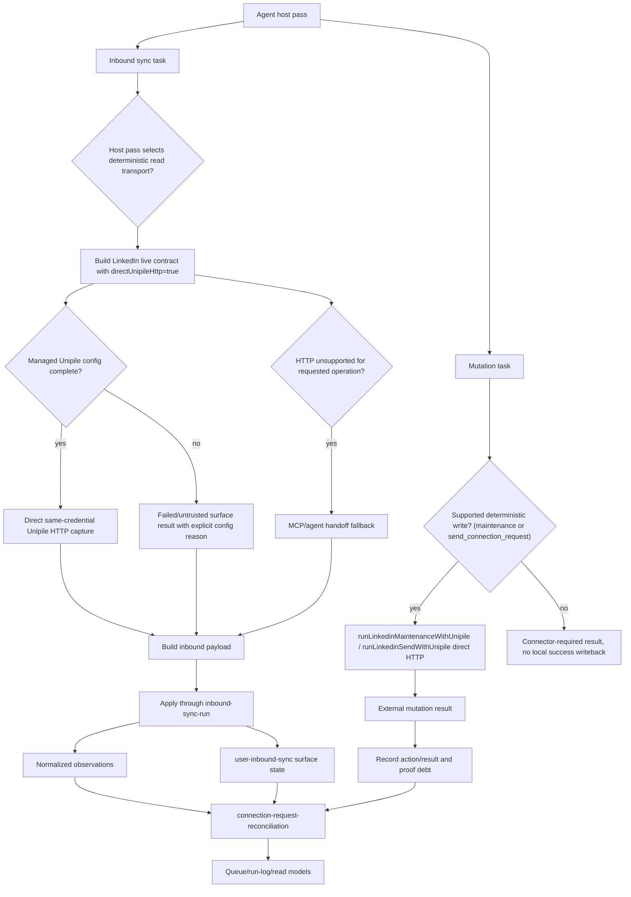

# Local-Runner Inbound Truth Stabilization Plan

Date: 2026-06-14
Scope: backend first. Fix the live local-runner capture path before adding new architecture.

## Executive Summary

The prior plan had the right direction on sync, reconcile, and mutate, but it aimed too high in the stack. The repo already has most of the ownership primitives that plan proposed to create:

- `src/core/user-inbound-sync.js` stores per-account surface state, continuation, backoff, and trust metadata.
- `src/core/connection-request-reconciliation.js` owns LinkedIn invitation reconciliation and mutation proof debt.
- `src/core/capability-seam-contract.js` owns the shared reconciliation result vocabulary.
- `src/core/agent-run-log.js` reads the existing `.exo` agent pass artifacts.
- `src/lib/backend-capability-registry.js` records surface and action ownership.

The real failure to fix now is lower level: local LinkedIn sync defaults to an LLM agent handoff for deterministic Unipile list pulls, then uses same-credential HTTP only as fallback. That is backward for this deployment mode. The scheduled runner also decides the first transport, so changing only `inbound-linkedin-live-sync.js` is not enough. The plan must change the production call sites, make deterministic managed transport primary when credentials and account identity are configured, make missing config loud, and prove the invitation loop end to end through existing owner modules.

## What I Agree With In The Review

- Do not create parallel `inbound-surface-state.js`, `mutation-ledger.js`, or new invitation reconciliation modules while the existing owners already cover those concepts.
- The LinkedIn list-pull transport is the main live reliability risk.
- The production host pass must request the deterministic transport first. A module-level change that leaves `run-agent-host-pass.js` on the old first attempt is dead code for the real runner.
- The mutate path needs the same treatment for supported LinkedIn maintenance writes. Sync can be fixed and mutation can still fail if withdraw, accept, decline, or send paths stay inverted.
- A partial or blocked provider pull must degrade the surface explicitly instead of looking like progress.
- The invitation flow is still the right tracer bullet.
- The proof rule remains: disappearance from sent invitations proves only `no_longer_pending`, not acceptance.

## What I Would Reframe

The product should still be connector-first at the policy level. But for local-runner LinkedIn list pulls, direct same-credential Unipile HTTP is a governed connector implementation when all of these are true:

- the account resolves to the managed Unipile connector
- `providerAccountId` is present
- `UNIPILE_API_KEY` is present
- the Unipile base URL is explicitly configured by env or Codex config

That is not a customer-specific hard-code. It is the deterministic transport for a configured managed account. MCP or agent handoff can remain available for capabilities that are not supported by the deterministic path or when a true connector operation requires it.

The same rule applies to supported write paths. `src/lib/linkedin-unipile-maintenance.js` already has direct HTTP implementations for connection-request status reconciliation, sent-invite withdrawal, and received-invite accept/decline. Those should not wait for an MCP failure in the local runner.

The send audit is already done: there is no deterministic Unipile write for the `send_connection_request` action today. `runSendTask` executes only through `buildLinkedinSendHandoff` plus the agent/MCP path, with no same-credential HTTP fallback at all, so the primary outbound action is the least reliable mutate in the system. Because Unipile exposes a send-invitation endpoint (`POST /api/v1/users/invite`) and the maintenance module already proves the same-credential HTTP pattern for `invite/sent` and `invite/received`, this board builds a deterministic send for `send_connection_request` rather than deferring it. Other outbound send actions (`send_direct_message`, comment, reaction) stay explicitly connector-required for this board and must not record local mutation success without a real external result.

## Objective

Make local-runner inbound LinkedIn sync trustworthy by changing the transport default, surfacing configuration gaps, and proving the invitation lifecycle through existing sync and reconciliation owners.

When done, Exo should be able to run a background pass and answer:

- Did the provider pull actually run?
- Which transport ran?
- Was the surface trusted, degraded, untrusted, partial, failed, or waiting?
- Did mutation proof debt move forward?
- If nothing moved, was it due to missing config, provider backoff, no runnable task, or a real provider failure?

## Definition Of Done

- Local LinkedIn list-pull surfaces use same-credential Unipile HTTP first in the scheduled host pass when the managed account is configured.
- The CLI and generic live-sync wrapper do not preserve the old default for configured local-runner LinkedIn pulls unless explicitly requested as diagnostic handoff mode.
- Supported LinkedIn maintenance mutations use same-credential Unipile HTTP first when the managed account is configured.
- `send_connection_request` uses a deterministic same-credential Unipile HTTP write path first when the managed account is configured, falls back to agent/MCP only when the deterministic path is unsupported or fails, and records local mutation success only when the external write returns success.
- Other outbound send actions (`send_direct_message`, comment, reaction) stay loudly connector-required with no local success writeback in this board.
- Missing API key, missing explicit base URL, or missing provider account id creates an untrusted or failed surface with an explicit reason.
- Agent handoff is fallback for unsupported deterministic pulls, not the first attempt for supported list pulls.
- A blocked or failed provider capture cannot be counted as quiet progress.
- A focused invitation test proves send debt, sent-list proof, withdrawal/no-longer-pending proof, and no false acceptance.
- Queue and run-log output expose transport, fallback, blocked, waiting, and partial reasons clearly enough for the UI to render them later.
- An optional env-gated smoke test can hit the configured Unipile `/api/v1/accounts` endpoint and verify that the live account identity matches `providerAccountId`.

## Non-Goals

- No new state primitive files unless a test proves the existing owners cannot express the behavior.
- No frontend redesign in this board.
- No live external sends, withdrawals, accepts, declines, replies, or deploys in tests.
- No browser-profile fallback for governed truth.
- No webhook dependency.
- No broad LinkedIn scan loop.

## Existing Pattern References

- Use the schema and surface-state pattern in `src/schema/inbound.js` and `src/core/user-inbound-sync.js` because they already persist `lastRunStatus`, `lastCaptureCompleteness`, `lastExhaustionStatus`, `lastReconcileRequired`, `nextCursor`, `nextStartOffset`, `nextAllowedSyncAt`, `backoffReason`, and `syncTrustStatus`.
- Use the invitation reconciliation owner in `src/core/connection-request-reconciliation.js` because it already owns pending, accepted, no-longer-pending, and mutation proof rules.
- Use the deterministic Unipile capture implementation in `src/core/inbound-linkedin-live-sync.js` because it already supports injected `unipileHttpGetImpl` and `unipileHttpPostImpl`.
- Use the host-pass transport and logging pattern in `scripts/run-agent-host-pass.js` because it already records transport, fallback reason, surface status, continuation cursor, and verification, and because it is the production call site that must request direct HTTP first.
- Use the direct maintenance implementation in `src/lib/linkedin-unipile-maintenance.js` because it already supports injected GET, POST, and DELETE implementations for status reconciliation, withdrawal, accept, and decline.
- Use the run-log reader in `src/core/agent-run-log.js` because current runtime history lives in `.exo` artifacts such as `agent-host-state.json`, `agent-last-pass.json`, and `agent.log`.

## Target Architecture



## Data Flow

1. The scheduler selects a LinkedIn inbound sync task.
2. `run-agent-host-pass.js` decides the first transport for the task and passes the direct HTTP request into `inbound-linkedin-live-sync.js` when the account is a configured managed Unipile account.
3. For supported list-pull surfaces, the contract attempts direct same-credential Unipile HTTP if account config is complete.
4. If config is missing, the contract returns a failed or untrusted payload that names the missing prerequisite.
5. `inbound-sync-run` applies the payload into the existing user surface state and observations.
6. Mutation tasks use `runLinkedinMaintenanceWithUnipile` directly for supported maintenance actions when the account is configured.
7. `send_connection_request` tasks use a deterministic same-credential Unipile send (`runLinkedinSendWithUnipile`) first when configured, with agent/MCP fallback; other send actions return a clear connector-required/blocking result without local success writeback.
8. `connection-request-reconciliation.js` reads observations and existing mutation proof metadata.
9. The queue and run log expose what moved, what waited, and what failed.

## Tracer Bullet

LinkedIn invitations remain first.

Required proof cases:

- `connection_request:sent` creates pending reconciliation debt against `linkedin-sent-invitations`.
- A sent-invitations pull that still includes the person keeps the debt pending as externally pending.
- A sent-invitations pull where the person disappears records `connection_request_no_longer_pending`.
- Disappearance does not mark accepted.
- Acceptance requires relationship/profile proof.
- Withdraw proof clears only through the invitation owner, not generic queue logic.

## Strategic Implementation Steps

### Phase 1. Make The Transport Deterministic

1. TDD: rewrite the locked test in `test/inbound-live-runtime-variants.test.js` that currently asserts direct HTTP does not run by default.
2. TDD: add a host-pass test proving `runInboundSyncTask` calls `runInboundContractImpl(task, { directUnipileHttp: true })` on the first attempt for a configured managed Unipile account.
3. Change `scripts/run-agent-host-pass.js` so the production runner requests direct HTTP first for configured managed LinkedIn list pulls.
4. Change `src/core/inbound-linkedin-live-sync.js`, `src/cli/commands/inbound.js`, and `src/core/inbound-live-sync.js` only as needed so the module and CLI do not preserve the old default.
5. Keep agent handoff for unsupported surfaces, explicit diagnostic handoff mode, or missing deterministic support.
6. Verify with focused inbound runtime and host-pass tests.

### Phase 2. Fix Supported Mutation Transport

1. TDD: add host-pass tests for `runBrowserActionTask` showing withdraw, accept, decline, and status-reconcile tasks call `runLinkedinMaintenanceWithUnipile(..., { allowDirectUnipileHttp: true })` first when configured.
2. TDD: add a mutation transport test for an MCP failure that must not block a supported direct HTTP maintenance task.
3. Change `scripts/run-agent-host-pass.js` so supported LinkedIn maintenance writes use direct HTTP first.
4. TDD: add a deterministic Unipile send for `send_connection_request`. Implement `runLinkedinSendWithUnipile` (extend `src/lib/linkedin-unipile-maintenance.js` or a sibling send module) that issues the send-invitation write (`POST /api/v1/users/invite`, exact body confirmed against the Unipile API) through the same injected GET/POST seams, verifies the resolved account identity matches `providerAccountId`, and returns a structured external result. Wire `runSendTask` to call it first for configured managed Unipile accounts, with `buildLinkedinSendHandoff` plus the agent/MCP path as fallback only.
5. TDD: prove `send_connection_request` records local mutation success and connection-request proof debt only when the external write returned success, and that other send actions (`send_direct_message`, comment, reaction) stay connector-required with no local success writeback.
6. Verify with focused host-pass, LinkedIn send, and LinkedIn maintenance tests.

### Phase 3. Make Missing Config Loud

1. TDD: add cases for missing API key, missing explicit base URL, missing `providerAccountId`, and account identity mismatch.
2. Return a governed failed or untrusted payload with explicit `syncTrustStatus`, `exhaustionStatus`, and a concrete reason.
3. If a specific `backoffReason` must survive writeback, include `src/core/inbound-linkedin-sync.js` in the task because legacy surface payloads must emit that field.
4. Ensure the host pass records the concrete reason instead of treating the pass as quiet progress.
5. Verify with focused inbound and host-pass tests.

### Phase 4. Prove Invitation End To End

1. TDD: use the existing HTTP injection seams to simulate sent invitations present, then absent.
2. Assert `connection_request:sent` stays pending while the invite is present.
3. Assert disappearance records `no_longer_pending` without accepted state.
4. Assert accepted requires relationship/profile proof.
5. Assert withdraw or received-invite mutation transport actually ran before proof debt is moved.
6. Verify with `test/connection-request-reconciliation.test.js`, `test/inbound-live-runtime-variants.test.js`, and the relevant host-pass tests.

### Phase 5. Prove Real Config Reachability

1. Add an env-gated integration test that runs only when explicit Unipile credentials and a provider account id are present.
2. Call the configured `/api/v1/accounts` endpoint.
3. Assert the returned identity includes the governed `providerAccountId`.
4. Keep this out of default unit-test runs unless the environment opts in.

### Phase 6. Expose Runtime Truth To The Queue

1. TDD: add queue or run-log assertions that blocked, waiting, partial, and ready are distinct.
2. Ensure queued counts do not imply runnable counts.
3. Ensure last-pass output names transport and config reasons.
4. Verify with `test/agent-host-pass.test.js`, `test/agent-queue.test.js`, and `test/agent-run-log.test.js`.

### Phase 7. Only Then Extend Real Gaps

After the invitation loop is green, add separate boards only for genuine gaps:

- Gmail sent-mail proof.
- LinkedIn entitlements for InMail or Sales Navigator.
- Public engagement retrieval.
- HubSpot CRM surfaces.

These should extend the existing registry and owners rather than create parallel state systems.

## Task Graph For The Loop Executor

Start the board with transport tasks first. Do not split this into service-owner tasks until the real runner has a deterministic first transport.

| Task | Owner lane | Files | Verification |
| --- | --- | --- | --- |
| T1. Direct HTTP primary at the read call site | controller | `scripts/run-agent-host-pass.js`, `src/core/inbound-linkedin-live-sync.js`, `src/cli/commands/inbound.js`, `src/core/inbound-live-sync.js`, `test/inbound-live-runtime-variants.test.js`, `test/agent-host-pass.test.js` | `npm test -- test/inbound-live-runtime-variants.test.js test/agent-host-pass.test.js` |
| T2. Direct HTTP primary for supported maintenance mutations | controller | `scripts/run-agent-host-pass.js`, `src/lib/linkedin-unipile-maintenance.js`, `test/agent-host-pass.test.js`, `test/linkedin-unipile-maintenance.test.js` | `npm test -- test/agent-host-pass.test.js test/linkedin-unipile-maintenance.test.js` |
| T2b. Deterministic Unipile send for `send_connection_request` | controller | `scripts/run-agent-host-pass.js`, `src/lib/linkedin-unipile-maintenance.js`, `src/core/build-linkedin-send.js`, `test/agent-host-pass.test.js`, `test/build-linkedin-send.test.js`, `test/linkedin-unipile-maintenance.test.js` | `npm test -- test/agent-host-pass.test.js test/build-linkedin-send.test.js test/linkedin-unipile-maintenance.test.js` |
| T3. Loud config failures for missing Unipile prerequisites | controller | `src/core/inbound-linkedin-live-sync.js`, `src/core/inbound-linkedin-sync.js`, `scripts/run-agent-host-pass.js`, focused tests | `npm test -- test/inbound-live-runtime-variants.test.js test/agent-host-pass.test.js` |
| T4. Invitation proof loop through existing owners | controller | `src/core/connection-request-reconciliation.js`, existing action/sync tests | `npm test -- test/connection-request-reconciliation.test.js test/inbound-live-runtime-variants.test.js test/agent-host-pass.test.js` |
| T5. Env-gated real Unipile account smoke test | controller | focused integration test file or existing Unipile test file | default skip plus opt-in command documented in the board |
| T6. Queue and run-log truth labels | controller or subagent | `src/core/build-agent-queue.js`, `src/core/agent-run-log.js`, `scripts/run-agent-host-pass.js`, tests | `npm test -- test/agent-queue.test.js test/agent-run-log.test.js test/agent-host-pass.test.js` |
| T7. Full integration verification | controller | no broad refactor | `npm test` and `git diff --check` |

This board is intentionally smaller than the prior architecture plan. Calendar time still matters, but the high-risk files overlap, so this should run as a tight controller loop first. Parallelize only T5 or T6 after T1 and T2 have settled the result shape.

## Acceptance Criteria

- A configured scheduled host-pass Unipile list pull does not default to `agent_handoff`.
- The host-pass test proves the first `runInboundContractImpl` call carries `directUnipileHttp: true` for configured managed LinkedIn accounts.
- Supported Unipile maintenance mutations do not default to MCP handoff.
- `send_connection_request` attempts the deterministic same-credential Unipile send first for configured managed accounts and does not default to MCP handoff.
- Send tasks cannot locally record success or open connection-request proof debt unless the external write path actually returned success.
- Missing Unipile config never produces a quiet zero-item success.
- The pass result includes a clear transport and config/fallback reason.
- Existing surface-state fields carry trust, backoff, continuation, and partial-status information.
- Existing invitation reconciliation owner remains the only place deciding pending, accepted, no-longer-pending, and not-accepted outcomes.
- `npm test` passes.
- `git diff --check` passes.

## Verification Commands

```bash
npm test -- test/inbound-live-runtime-variants.test.js
npm test -- test/agent-host-pass.test.js
npm test -- test/linkedin-unipile-maintenance.test.js
npm test -- test/build-linkedin-send.test.js
npm test -- test/connection-request-reconciliation.test.js
npm test -- test/agent-queue.test.js test/agent-run-log.test.js
npm test
git diff --check
```

## Safety Boundaries

- Tests use fixtures or injected HTTP implementations only.
- Do not write to the live `.exo` workspace state during tests.
- Do not hard-code a tenant Unipile host in product code.
- Do not bypass managed account identity checks.
- Do not mark a surface healthy because one page was fetched.
- Do not rely on webhook triggers in local-runner mode.
- Do not let injected-HTTP unit tests stand in for the optional real-account smoke test when the question is live reachability.

## Relationship To Existing Docs

This replaces the first version of this plan. It preserves the sync/reconcile/mutate model from:

- [docs/wip/backend-sync-reconcile-mutate-audit.md](/Users/williamflanagan/Projects/omalab/exo/docs/wip/backend-sync-reconcile-mutate-audit.md:1)
- [docs/wip/remaining-sync-reconcile-mutate-seams.md](/Users/williamflanagan/Projects/omalab/exo/docs/wip/remaining-sync-reconcile-mutate-seams.md:1)

The change is focus: do not rebuild primitives that already exist. Fix the live transport and the failure reporting first.
