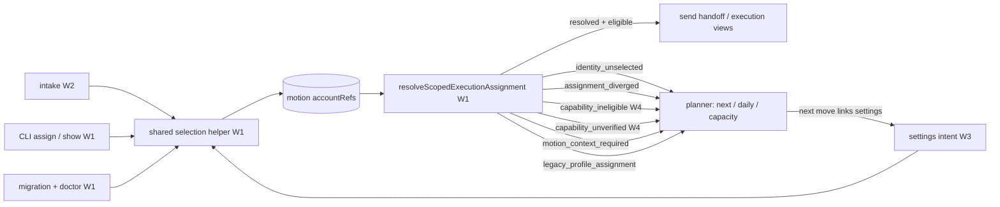

# Motion account selection plan

Status: locked for implementation.
Created: 2026-06-11. Locked: 2026-06-11 (all open questions resolved by
the operator; see Decisions). Revised: 2026-06-11, twelve Codex plan
review rounds applied (see Revision log).

One operator owns several connected accounts (two knit emails, an audienti
gmail, one LinkedIn). Different motions need different subsets of those
accounts, and subsets overlap (the same LinkedIn serves multiple motions).
Today there is no real selection step: assigning a user to a motion silently
attaches every account they own, and the send-time resolver then refuses to
choose between two accounts of the same channel. This plan makes per-motion
account selection — the motion's persona — a first-class setup step.
User-level account groups were considered as an alternative shape and
deferred (W5); they are not part of this deliverable.

## Current behavior (verified in code)

- Accounts live on the user: `user.accounts[]` with `capability`
  (`gmail`, `linkedin`, ...), `handle`, `preferred`, `sourceType`
  (`src/schema/user.js`).
- The storage slot for per-motion selection already exists:
  `motion.engagementUserAssignment.accountRefs` (`src/schema/motion.js`),
  refs formatted as `capability:handle`.
- But every assignment entry point omits refs, and the default is ALL of
  the user's accounts (`src/core/assign-motion-user.js:55-69`):
  - `exo motion start --launch-user` (`src/cli/commands/motion.js:264`)
  - UI `assignMotionUser` intent drops `accountRefs` even if sent
    (`src/core/execute-action-intent.js:661`)
  - intake launch (`src/core/start-motion-from-intake.js:36,119,221`)
- At send time the resolver requires at most ONE ref per capability;
  two gmail refs → `identity_ambiguous`, execution blocks
  (`src/core/resolve-scoped-execution-assignment.js:227-241`). With no
  refs it falls back to preference ordering, which also errors when two
  managed accounts exist without a single `preferred` one
  (`src/core/resolve-user-connection.js`).
- Net effect: an operator with two gmail identities blocks every email
  motion unless they hand-pin refs through the one existing surface,
  `exo motion user assign --account ...` (`src/cli/commands/motion.js:1618`).
  No UI surface exists; motion settings only offers "Assign current user"
  (`src/artifacts/render-motions.js:875-906`).
- Adjacent defaults that feed the "everything is the main user" feel:
  - inbound sync picks the FIRST account of a capability when no
    `accountId` is passed (`src/core/inbound-gmail-sync.js`,
    `src/core/inbound-linkedin-sync.js`)
  - claiming flows map discovered accounts onto a user without a
    "which user owns this" step when more than one user exists
- Company-level overrides already exist and use the same field
  (`company.engagementUserAssignment.accountRefs`), resolved before the
  motion assignment (`src/core/resolve-scoped-execution-assignment.js:24`).
- `motion_accounts.execution_user_id` is today always derived from the
  single motion-level assignment; there is no real multi-user motion yet.

## Decisions

Locked by operator decision, 2026-06-11:

- **Account and channel availability is defined on the motion, only.**
  No company-level and no per-prospect account exceptions. The motion is
  the single authority for which accounts it may act as. Why: the same
  company can be targeted by two motions running completely different
  go-to-market strategies — e.g. agencies Knit and Actico both targeting
  KeyBank — and each motion connects through a different identity. So
  identity hangs off the motion, never the company. Consequence: the
  existing company-level `accountRefs` path (which resolves ahead of the
  motion today) must stop influencing account selection — see W1.
- **A missing channel never blocks launch.** The motion launches and
  advances each prospect as far as the selected channels allow (cadences
  default LinkedIn-first today). When a prospect's next step needs a
  channel with no selected account, that becomes a demand-driven
  operator next move — "this motion needs an email account to continue,
  N prospects are waiting" — raised through the planner surfaces, not a
  silent send-time failure. See W4.
- **Ref format stays `capability:handle`** (confirmed; revisit only if
  handle renames bite).
- **Vocabulary: "persona".** The operator-facing word for an acting
  identity. The motion's selected per-channel accounts are presented as
  the motion's persona; if the deferred user-level grouping (W5) is ever
  revived it uses the same word.
- User-level account groups are NOT part of availability. They were
  considered as the alternative shape ("add groups to the user") and
  rejected in favor of motion-scoped selection. W5 is deferred and at
  most a future picker convenience.

Design rationale:

- The motion assignment is already the system of record the resolver
  reads. Surfacing it is the smallest correct change.
- Overlap across motions needs no special handling: refs are independent
  per motion and may point at the same account.

Semantics to lock:

- `accountRefs` on a motion assignment means "the accounts this motion is
  allowed to act as", with at most one ref per capability FAMILY,
  enforced at write time instead of send time (`linkedin:x` plus
  `sales-navigator:y` is two LinkedIn identities and is rejected, the
  same as two gmail refs).
- Selection problems surface at setup time as warnings and, once a
  prospect actually needs the missing channel, as planner next moves —
  never as send-time `identity_ambiguous` from stored state.
- Company user assignment keeps its routing meaning (who works this
  company, including the fail-closed missing-user rule), but it no
  longer carries an account scope of its own.
- Channel slots are capability FAMILIES. The linkedin family
  (`linkedin`, `linkedin-premium`, `sales-navigator`) fills one slot: a
  motion persona has one LinkedIn identity, one gmail, one hubspot.
  Refs still store the account's concrete `capability:handle`. Family
  matters at selection grouping (W1) and step eligibility (W4) only —
  a selected concrete ref resolves exactly, and `resolveUserConnection`
  keeps its exact capability match
  (`src/core/resolve-user-connection.js:29`).

## Target shape

One helper writes refs; one resolver reads them; every non-ready status
becomes a routed planner item that links back to the settings writer.

## Non-goals

- Multiple users per motion. `execution_user_id` stays derived from the
  one motion assignment.
- Multiple same-capability accounts active in one motion (rotation, load
  balancing across inboxes). If needed later, the availability-set shape
  introduced here extends to it.
- Company-level or per-prospect account exceptions. Decided out
  (2026-06-11): availability is motion-only.
- Moving an account from one user to another (manual re-claim covers it).

## W1: core semantics — select at setup, never break at send

Why this matters: today the default ("all accounts") writes stored state
that the resolver is guaranteed to reject for any user with two accounts
on one channel.

Work:

1. Introduce one shared selection helper (e.g.
   `src/core/select-assignment-accounts.js`) that, given a user and
   optional explicit refs, returns selected refs, per-capability
   candidates, and duplicate/ambiguous warnings, and performs write-time
   validation. Every writer and reader uses it — `assignMotionUser`,
   `assignCompanyUser` (during transition), intake, the settings intent,
   migration, doctor — replacing the duplicated default-all
   `resolveAssignmentAccountRefs` in `src/core/assign-motion-user.js:55`
   and `src/core/assign-company-user.js:55`. Resolver rules live in one
   place; nothing re-implements them.
2. Change the `assignMotionUser` default through that helper: when
   `accountRefs` is omitted, auto-select a capability's account only
   when `resolveUserConnection` returns exactly one resolved account
   for it (resolutionStatus `resolved`); otherwise select none — it
   surfaces as needing selection. Never authorize a sender by sort
   order: the candidate ordering in `resolve-user-connection.js:533` is
   for display, and managed-account resolution deliberately returns
   `identity_ambiguous` when multiple explicit accounts exist without
   exactly one preferred (`resolve-user-connection.js:555-585`).
   Auto-pick must not be broader than the resolver it fronts. The
   helper groups selection slots by capability family (one LinkedIn
   slot spanning `linkedin` / `linkedin-premium` / `sales-navigator` —
   see Semantics); the stored ref is the concrete account. A family
   whose candidates span multiple concrete capabilities (one `linkedin`
   account plus one `sales-navigator` account) is two candidate
   identities for one slot: ambiguous, auto-select none.
3. Reject explicit input containing more than one ref per capability
   FAMILY with an actionable error at assign time — `linkedin:x` plus
   `sales-navigator:y` is two LinkedIn identities, rejected the same as
   two gmail refs.
4. Selection state (selected ref / unselected + candidates / warnings)
   is DERIVED via the helper from `accountRefs` × the user's current
   accounts, never persisted. Only `accountRefs` is stored on the
   assignment — no schema change to the shared assignment record
   (`engagementUserAssignment` in `src/schema/company.js` /
   `src/schema/motion.js`), so candidate lists cannot go stale when
   accounts are claimed later and config export/import is unaffected.
5. Pass `args.accountRefs` through the UI `assignMotionUser` intent.
6. Migration/normalization pass for existing motions: rewrite stored
   assignments to ≤1 ref per capability family with the same auto-pick;
   ambiguous families become unselected + flagged. Surface flagged
   motions in `exo agent doctor`.
7. Make the motion the only account authority in the resolver
   (`resolveScopedExecutionAssignment`): company user assignment keeps
   routing WHO works the company (fail-closed missing-user rule
   unchanged), but stored `company.engagementUserAssignment.accountRefs`
   no longer constrain account selection. When the company-routed user
   matches the motion's user, the motion's refs apply. When they
   differ, FAIL CLOSED with a distinct `assignment_diverged` status and
   raise a reconcile next move (reassign the company to the motion's
   user, or change the motion's user) — never fall back to preference
   resolution, which would execute as an account no motion authorized.
   Divergence must also be visible to planner scope classification:
   `classifyUserExecutionScope` (`src/core/user-execution-scope.js:14`)
   resolves company-before-motion today, so a diverged pair would show
   up as normal work for the company-routed user. It and its consumers
   (`src/core/build-daily-view.js`,
   `src/core/build-outbound-capacity-view.js`) classify divergence as a
   reconcile item — it must not disappear from one user's queue or
   appear as normal work for the wrong user.
8. `assignCompanyUser` stops snapshotting all accounts into the company
   assignment (`src/core/assign-company-user.js:55-69` has the same
   default-all bug); going forward company assignments are written
   without an account scope, and migration ignores any stored company
   refs.
9. Keep normalized rows consistent on reassignment: `updateMotion`
   (`src/db/motions.js`) only rewrites the motions row today — unlike
   `insertMotion`, which calls `replaceMotionTargetMapRows` — so
   changing a motion's user must also update
   `motion_accounts.execution_user_id` for that motion's rows in the
   same transaction. Queue and daily filters select on that column
   (`src/db/motions.js:250,291,352`) and would otherwise keep routing
   work to the previous user.
10. Duplicate-ref invariant on user accounts, enforced centrally: one
    user cannot hold two accounts with the same `capability:handle`
    pair (the ref format cannot distinguish them — e.g. the same gmail
    handle claimed through two runtimes). The invariant lives in
    `userSchema` (refine over `accounts`) so every parse path enforces
    it — including config import, which writes parsed users directly
    (`src/core/import-config.js:108`) — plus a friendly early error in
    `upsertUserConnectedAccount`
    (`src/core/upsert-user-harness-connection.js:67`). The W1 migration
    dedupes any existing stored duplicates BEFORE the schema refine
    ships; otherwise stored users failing parse would fail closed
    everywhere. The survivor rule is deterministic and tested. Note
    that motion refs address `capability:handle`, which matches BOTH
    duplicates equally — refs cannot pick the survivor. Keep the
    account with (1) a `providerAccountId` (explicit identity proof),
    then (2) `preferred: true`, then (3) `sourceType
    "harness-connection"` over `"browser-profile"`, then (4) newest
    `updatedAt`. Losers are dropped, the survivor keeps its own id, and
    stored motion refs are unaffected because the surviving
    `capability:handle` is identical.
11. Resolver-level `identity_unselected` (the status is DEFINED here;
    W4 consumes it): when a motion has a user assignment and its refs
    contain no entry for the requested capability, resolution returns
    `identity_unselected` instead of falling back to unconstrained
    user-level preference resolution — today
    `resolve-scoped-execution-assignment.js:223-224` does exactly that
    fallback, which under motion-only authority would pick an account
    no motion authorized (e.g. the user's preferred gmail for a motion
    that selected no gmail). The unconstrained path remains only for
    the auto-singleton chain, where no explicit assignment exists.
    Resolution is family-aware end to end, with one explicit
    conversion: callers state a capability FAMILY requirement (from the
    W4 step contract; a legacy `capability: "linkedin"` request
    normalizes to the linkedin family) → the scoped-ref lookup selects
    the motion's ref whose capability belongs to that family (a
    selected `sales-navigator:x` satisfies a linkedin-family request) →
    `resolveUserConnection` is called with that ref's exact concrete
    capability. Today's prefix filter
    (`ref.startsWith(`<capability>:`)`,
    `resolve-scoped-execution-assignment.js:218`) would wrongly report
    a sales-navigator selection as unselected for a `linkedin` request;
    `identity_unselected` means NO ref in the requested family.
12. `exo motion user show <motion-id>` (and `--json`) renders the
    derived per-capability selection state from the shared helper —
    selected ref, unselected + candidates, ambiguous, grouped by family
    slot (`src/cli/commands/motion.js`, the existing `motion user show`
    subcommand). This is the owner of the per-capability-state
    acceptance line below.
13. Audit and close company-ref side paths: outside migration and
    read-only display of legacy data, nothing may read
    `company.engagementUserAssignment.accountRefs` for account
    selection or eligibility. Known leaks today, all of which must
    switch to resolver/shared-helper outputs:
    - `src/core/build-agent-queue.js:166` — the connection-note/premium
      verdict falls back to raw company refs;
    - `src/core/build-agent-queue.js:2014` — a fallback LinkedIn
      account picker reads the company assignment directly, bypassing
      the resolver entirely;
    - `src/cli/exo-ui-server.js:419-423` — `connectionNoteCapable`
      falls back to company refs.
    The resolver itself is inside this rule, not exempt from it:
    `resolveScopedExecutionAssignment` may read the company assignment
    for user ROUTING (`userId`), but must not pass company
    `accountRefs` into account resolution — the read at
    `resolve-scoped-execution-assignment.js:29` is removed (at most,
    company refs may surface as ignored legacy diagnostics).
14. No company-keyed sender or eligibility fallback anywhere in the
    queue/planner: sender identity and premium eligibility are always
    scoped motion+company, or resolve to the appropriate
    blocked/unselected status — never borrowed across motions. Today
    `build-agent-queue.js` keeps a `senderPremiumByCompany` map
    (line 137), writes it per company (line 172), and falls back to it
    (line 490); queue accounts derived from canonical
    `company.motionIds` (line 878) never get a motion+company scope
    entry — the scope map is populated only from legacy `targetMap`
    accounts — so the company-keyed fallback is the LIVE path for
    them: two motions targeting the same company bleed premium reach
    across personas, the exact cross-persona leak the motion-only
    decision forbids (Knit and Actico both targeting KeyBank). Remove
    the company-keyed map; a missing scope entry computes its own
    motion-scoped verdict or yields the non-ready status.
15. Motion context is required to resolve accounts for multi-motion
    companies. With motion-only authority, resolving a company's
    account with no motion supplied is ill-defined when the company
    belongs to more than one motion — which persona? New status
    `motion_context_required`: callers that resolve without a motion
    (`exo companies execution show` has an optional `--motion`,
    `src/cli/commands/companies.js:353`; UI company pages calling
    `buildCompanyExecutionView` without one) get
    `motion_context_required` and NO resolved account when the company
    links to two or more motions. Exactly one linked motion → resolve
    in that motion's context and say so in the output. Zero linked
    motions → the existing no-assignment chain (auto-singleton).
16. Legacy engagement profile assignments stop being account
    authority. The resolver still honors
    `company.engagementProfileAssignment` and
    `motion.engagementProfileAssignment` ahead of motion user
    assignment (`resolve-scoped-execution-assignment.js:53,93`), while
    browser-profile execution is already blocked downstream — so a
    profile assignment can only produce a dead identity or bypass
    selection. They become blocked legacy state: resolution returns a
    `legacy_profile_assignment` status (fail closed) with a reconcile
    next move ("assign a user to this motion/company instead"), and
    doctor flags every stored profile assignment. Migration keeps them
    for display/diagnostics only.
17. Resolver/view output gains `selectedAccountRefs` — the
    motion-scoped selection and nothing else. Today
    `buildCompanyExecutionView` falls back to ALL the user's accounts
    when assignment refs are empty
    (`build-company-execution-view.js:52`), and send handoffs pass
    that list into pinned-identity policy — leaking unselected
    identities into execution contracts an agent could act on. Remove
    the all-accounts fallback; email and LinkedIn send policies and
    handoff `sender.accountRefs` consume only `selectedAccountRefs`.
18. Retire the profile-assignment write paths along with their
    authority — item 16 is incoherent without this, since blocked
    legacy state must not stay creatable. `exo motion profile assign`
    (`assignMotionProfile`, `src/cli/commands/motion.js:1530`) and
    `exo companies profile assign` (`assignCompanyProfile`,
    `src/cli/commands/companies.js:281`) stop writing new assignments
    and instead error with guidance naming the replacement
    (`exo motion user assign` with `--account`). These two CLI
    commands are the only write paths — no UI intent for profile
    assignment exists in `execute-action-intent.js` — so this closes
    creation completely. The core writer functions are kept only if
    migration/diagnostics need them; otherwise deleted with their
    tests. Retirement includes discovery and help surfaces, so agents
    are never instructed to run a command that intentionally fails:
    the operator contract example in `src/core/what-is-this.js:384`
    (`exo companies profile assign ...`), the CLI help workflows in
    `src/cli/commands/companies.js:103` and
    `src/cli/commands/motion.js:108` (`profile show/assign`), and any
    other recommendation/example mentioning profile assignment are
    updated or removed, with help/what-is-this output assertions in
    the tests.
19. Retire the read-side bypass: `exo profiles resolve --company`
    honors sticky company profile/user assignments as identity
    authority (`src/cli/commands/profiles.js:373` option; `:428-436`
    resolution modes `company-assignment`,
    `blocked-by-company-assignment`, `company-user-assignment`; `:503`
    prints "Use assigned profile ..."). The assignment-honoring modes
    become diagnostic-only: legacy state is reported, no
    resolved-for-use profile, no "use this" guidance. The base
    `--capability` best-verified-match behavior is untouched — browser
    profiles as a local tool are out of scope here; their AUTHORITY is
    not. The existing expectations asserting `company-assignment`
    resolution (`test/cli.test.js:2224`) are retired and replaced.
20. Copy-forward paths — verified state and the tests that pin it
    (corrects round 11, which wrongly described all three files as
    carrying legacy state forward): `clone-motion.js:41` and
    `add-company.js:36` ALREADY null both engagement assignments —
    they get regression tests pinning that behavior (a clone of a
    motion carrying a legacy profile assignment yields
    `engagementProfileAssignment: null`; a new company starts null),
    not behavior changes. `rehydrate-motion.js:97` PRESERVES the
    stored assignment and MUST keep doing so: rehydration
    reconstructs an existing motion, and dropping the field there
    would erase the legacy evidence item 16's doctor flags and
    read-only display depend on. Display renderers
    (`render-company.js`, `render-motion.js`) and report/action views
    keep showing stored legacy state read-only.
21. Docs cleanup for retired profile guidance — complete sweep list,
    not just the flagged two: `docs/browser-profiles.md:209`
    ("profiles resolve should honor that assignment"),
    `docs/agent-usage.md:399` ("agents should prefer ... profiles
    resolve" for browser identity), plus the profile-assign/resolve
    workflow guidance in `docs/cli-guide.md`,
    `docs/cli-mcp-contract.md`, and `docs/installation.md` — rewritten
    to point at motion persona selection (`exo motion user assign
    --account`, motion settings). The historical spec under
    `docs/superpowers/specs/` is archival and explicitly exempt.

Acceptance:

- Assigning a user with two gmail accounts and no explicit refs yields
  one LinkedIn ref, zero gmail refs, and a gmail needs-selection warning
  — not a stored two-gmail assignment.
- Storing two gmail refs fails at assign time with a message naming both
  candidates; storing `linkedin:x` plus `sales-navigator:y` fails the
  same way (one LinkedIn family slot).
- A motion whose selected LinkedIn ref is `sales-navigator:x` resolves
  a linkedin-family request to that exact account — never
  `identity_unselected` (regression test in
  `test/execution-resolution.test.js`).
- A company assignment carrying stale refs cannot override the motion's
  selected identity (regression test in
  `test/execution-resolution.test.js`). The existing expectation that
  company-specific refs persist —
  `test/user-assignment.test.js:190` "assignCompanyUser persists
  explicit account refs for company-specific routing" — is RETIRED and
  replaced, not extended.
- Company-routed user ≠ motion user yields the fail-closed
  `assignment_diverged` status and its reconcile next move, never a
  preference-resolved account — and the diverged pair shows up in daily
  and capacity views as a reconcile item, not as normal work for the
  company-routed user (tests over the `classifyUserExecutionScope`
  consumers).
- An assigned motion whose refs contain no `gmail:` entry resolves
  gmail to `identity_unselected` — it never picks the user's preferred
  gmail (regression test in `test/execution-resolution.test.js`).
- Auto-pick never selects by sort order: a user with two explicit
  managed gmail accounts and no preferred yields zero gmail refs.
- Reassigning a motion's user updates `execution_user_id` on that
  motion's `motion_accounts` rows in the same write; queue and daily
  views reflect the new owner immediately (regression test).
- Claiming, upserting, or importing a user with two accounts sharing
  one `capability:handle` fails with a clear error; the migration
  dedupes existing stores before the schema invariant lands.
- After migration, no stored motion assignment has two refs for one
  capability family; `exo motion user show <id>` displays per-family
  selection state.
- No account selection or eligibility path reads company `accountRefs`:
  the three audited sites (`build-agent-queue.js:166`,
  `build-agent-queue.js:2014`, `exo-ui-server.js:419`) use resolver
  outputs and are covered by tests, AND the resolver itself no longer
  passes company `accountRefs` into account resolution
  (`resolve-scoped-execution-assignment.js:29` removed or reduced to
  ignored legacy diagnostics). A repo-wide search finds company-ref
  readers only in migration and legacy display.
- Same company targeted by two motions with different LinkedIn premium
  states: each motion's queue work sees only its own motion's premium
  verdict — gating never crosses motions, including for accounts
  derived from canonical `company.motionIds` (regression in
  `test/agent-queue.test.js`).
- A company linked to two motions, resolved with no motion context,
  returns `motion_context_required` and no account (CLI and view
  tests); with exactly one linked motion it resolves in that motion's
  context and names it.
- A stored company or motion profile assignment yields
  `legacy_profile_assignment` — never a resolved account or transport
  (regression in `test/execution-resolution.test.js`). The doctor
  warnings — every stored profile assignment, every needs-selection
  motion — are tested in `test/agent-doctor.test.js`.
- `exo motion profile assign` and `exo companies profile assign` no
  longer create assignments: they fail with guidance naming the
  user/account selection path, and no help, example, or
  `exo what-is-this` output still recommends them (CLI and
  output-assertion tests in `test/cli.test.js`; what-is-this coverage
  in its existing suite).
- `exo profiles resolve --company <id>` against a stored assignment
  returns diagnostic legacy state and no usable profile; the
  `company-assignment` expectations at `test/cli.test.js:2224` are
  replaced. Cloning a motion that carries a profile assignment
  produces a clone with `engagementProfileAssignment: null`
  (regression pins the existing behavior); rehydrating that same
  motion preserves its stored legacy assignment for doctor and
  display.
- The legacy-profile class is closed by INVARIANT, not enumeration: a
  repo-wide search for `engagementProfileAssignment` finds readers
  only in schema definitions, migration, persistence/rehydration
  plumbing that round-trips stored state unchanged, doctor,
  diagnostic output, and read-only display — no resolution path, no
  recommendation surface, no creation of NEW assignments — and no doc
  or help text outside archival specs recommends profile assignment
  or assignment-honoring resolve modes. This invariant is the acceptance for items 16 and 18-21; new
  surfaces found during implementation fall under it without
  requiring a plan revision.
- No execution contract carries refs beyond the motion's selection:
  send-handoff `sender.accountRefs` equals `selectedAccountRefs`
  exactly, with the all-accounts fallback gone (tests in the new send
  test files).
- Extended tests pass in `test/user-assignment.test.js`,
  `test/execution-resolution.test.js`,
  `test/execute-action-intent.test.js`, `test/agent-queue.test.js`
  (the two audited queue sites), and `test/exo-ui-server.test.js`
  (the `connectionNoteCapable` site).

## W2: setup flows ask the question

Why this matters: the launch path is where the operator has context;
selection must happen there, not as post-hoc CLI surgery.

Work:

1. Motion intake gains an account-selection step after the launch-user
   question (`src/core/build-motion-intake.js`): list the launch user's
   accounts grouped by capability FAMILY via the shared helper — one
   LinkedIn slot, so a user with `linkedin` and `sales-navigator`
   accounts sees one LinkedIn choice with two options, never two
   separate slots — prefill with the W1 auto-pick. For
   an ambiguous capability the operator must make an explicit decision,
   and "none for now" is a first-class valid choice — the motion
   launches with that channel unselected and the W4 next move picks it
   up when a prospect actually needs it. What intake forbids is
   SILENTLY inheriting both candidates — never launching. (Per the
   locked gating decision: a missing channel never blocks launch.)
2. UI intake renders it (`motion-intake-ui` path) and
   `start-motion-from-intake` forwards the chosen refs.
3. `exo motion start` accepts repeated `--account <capability:handle>`
   flags and prompts interactively when ambiguous — with a
   noninteractive contract for agent/`--json`/no-TTY use, where a
   prompt must never block: an ambiguous family with no explicit flag
   stores none for that family plus a warning in the output (the
   "none for now" semantics), and an explicit
   `--no-account <family>` flag makes that choice deliberate and
   silences the warning.
4. `clone-motion` carries refs when the user is unchanged; otherwise the
   clone re-runs selection.

Acceptance:

- Creating a motion through UI intake with a two-gmail user requires an
  explicit gmail decision — one account or "none for now" — and "none
  for now" still launches, with gmail unselected and surfaced per W4.
  Silently inheriting both gmail accounts is impossible.
- CLI parity: `exo motion start --account gmail:x@y.com ...` produces the
  same stored refs as the UI flow.
- Noninteractive launch never blocks on a prompt: with `--json` and an
  ambiguous gmail family, launch succeeds with gmail unselected plus a
  warning in the JSON output; `--no-account gmail` produces the same
  stored state with no warning.
- A cloned motion with the same user keeps the source selections.
- Tests extended in `test/build-motion-intake.test.js`,
  `test/motion-intake-ui.test.js`, `test/cli.test.js`.

## W3: motion settings UI — edit the selection

Why this matters: selections change (new client inbox, retired alias);
today the only edit path is a CLI flag nobody discovers.

Work:

1. Replace the "Launch will inherit ..." line in execution settings
   (`src/artifacts/render-motions.js:875`) with an account picker:
   claimed accounts grouped by capability FAMILY via the shared helper,
   one radio group per family plus "none", current selection marked —
   the same one-LinkedIn-slot presentation as intake (W2).
2. Save via the `assignMotionUser` intent with `accountRefs` (enabled by
   W1 item 5).
3. Show a warning row for any capability the motion's playbook needs
   that has no selected account, linking the picker.

Acceptance:

- Changing a motion's gmail identity from `/motions/:id/settings` works
  end to end without the CLI and survives reload.
- A motion needing email with no gmail selected shows the warning on its
  settings page.
- UI tests extended (`test/exo-ui-server.test.js` or the motions render
  suite).

## W4: visibility, blocked reasons, and demand-driven next moves

Why this matters: overlap is intentional; the operator needs to see it.
And per the locked gating decision, a missing channel must turn into a
routed next move exactly when a prospect needs it — never a launch
blocker, never a silent send-time failure.

Work:

1. Connections page (`/users/:id/connections`,
   `src/core/build-connections-view.js`): per account, show "used by"
   chips listing motions whose refs include that account.
2. Motion detail header shows the motion's persona: the sending identity
   per channel, with unselected channels visible.
3. Send-handoff blocked reasons for every non-ready status
   (`identity_unselected`, `identity_ambiguous`,
   `capability_ineligible`, `capability_unverified`,
   `assignment_diverged`, `legacy_profile_assignment`) name the motion
   and point at `/motions/:id/settings` (UI) or the
   `exo motion user assign` command (CLI/agent paths) — never stale
   profile/company wording — implemented and tested in BOTH resolve
   sites: `src/core/build-send-handoff.js` (email) and
   `src/core/build-linkedin-send.js:87`, which builds its own execution
   view and blocked reasons for every LinkedIn surface.
   (`motion_context_required` cannot arise here: send handoffs are
   motion-scoped by construction.)
4. Define the step→capability contract: one helper that maps a cadence
   step / action key to the capability FAMILY it requires plus any
   eligibility, built on the existing mapping
   (`recommendedActionKeyForCadenceStep`,
   `src/core/build-motion-action-view.js:568`):
   - connection-request / direct-message → any linkedin-family account
     (`linkedin`, `linkedin-premium`, `sales-navigator`);
   - value-add-email → `gmail`;
   - inmail → a linkedin-family account WITH premium eligibility.
     InMail is a Premium/Sales Navigator feature, not plain LinkedIn
     transport. Reuse the existing tri-state plan-tier verdict shape
     (`connectionNoteCapabilityForAccount`,
     `src/core/connection-note-capability.js`: capability in
     `CONNECTION_NOTE_CAPABILITIES`, or `linkedin` plus premium
     metadata evidence → eligible; verified free tier → ineligible; no
     evidence → unverified). A selected plain-`linkedin` account that
     is verified free must NOT look ready for an inmail step — it
     resolves to a distinct `capability_ineligible` status with its own
     next move ("select a Premium/Sales Navigator LinkedIn account or
     change the cadence step"). A tier with NO evidence resolves to its
     own `capability_unverified` status with concrete runtime
     semantics: the inmail send HOLDS (a blocked contract carrying a
     verification fix path — refresh discovery/auth probe for the
     account, or select a verified premium account) and raises a
     verification next move, while research and other channels proceed.
     Send handoff is binary ready/blocked — "warning" is not a
     transport state, so unverified must never drift into ready.
   "The playbook needs email" means: at least one prospect's due step
   maps to a family/eligibility no selected account satisfies.
5. Consume the resolver status `identity_unselected` (defined in W1
   item 11 — the motion authorizes no account for this capability):
   send handoff, execution views, and the planner keep it distinct from
   `not_found`, `identity_ambiguous`, `assignment_diverged` (W1),
   `motion_context_required` (W1 item 15), `legacy_profile_assignment`
   (W1 item 16), `capability_ineligible`, `capability_unverified`
   (item 4), and connector-unavailable. It is the trigger for the next
   move below; the `assignment_diverged` reconcile move (W1 item 7),
   the `legacy_profile_assignment` reconcile move (W1 item 16), the
   `capability_ineligible` move, and the `capability_unverified`
   verification move (item 4) route through the same planner surfaces.
6. Demand-driven channel escalation: when one or more prospects' due
   step resolves to `identity_unselected`, raise an operator next move
   through the existing planner surfaces (`exo next` operatorPrompt,
   daily agenda, motion blocker actions —
   `src/core/build-next-view.js`, `src/core/build-daily-view.js`,
   `src/core/build-motion-action-view.js`): "Motion X needs an email
   account to continue — N prospects are waiting", linking motion
   settings. Prospects hold at that step (no skip, no failure spam) and
   unblock on the next pass after an account is selected.
7. Map the inmail surface in the LinkedIn send handoff:
   `resolveLinkedinActionForSurface`
   (`src/core/build-linkedin-send.js:177`) has no `in_mail_message`
   case today, so an InMail draft would fail before the eligibility
   logic above ever runs. Add the mapping plus a send-handoff test so
   inmail flows reach ready / `capability_ineligible` /
   `capability_unverified` instead of erroring.

Acceptance:

- The connections page shows at a glance that the LinkedIn account
  serves multiple motions while each gmail serves one.
- A blocked email or LinkedIn send's reason string includes the motion
  settings fix path, tested in both `build-send-handoff` and
  `build-linkedin-send` paths.
- Test ownership (named because several modules have no test file
  today): NEW `test/build-send-handoff.test.js` (email statuses and fix
  paths) and NEW `test/build-linkedin-send.test.js` (LinkedIn statuses,
  the `in_mail_message` mapping, fix paths); next-move triggers extend
  the existing `test/build-next-view.test.js`; daily/agenda coverage
  extends the existing `buildDailyView` suites
  (`test/profile-view-signal.test.js`, `test/cli.test.js`); motion
  blocker actions extend `test/direct-message-surface.test.js`
  (existing `buildMotionActionView` coverage); connections "used by"
  chips extend `test/profile-view-signal.test.js` (existing
  `buildConnectionsView` coverage).
- `identity_unselected` appears as its own status in `--json` outputs
  (execution view, send handoff, next), distinguishable from
  `not_found`, `identity_ambiguous`, `assignment_diverged`,
  `motion_context_required`, `legacy_profile_assignment`,
  `capability_ineligible`, and `capability_unverified`.
- A motion whose selected LinkedIn account is verified free tier, with
  a prospect due on an inmail step, surfaces `capability_ineligible`
  and its next move — it never reports ready. An unverified tier
  surfaces `capability_unverified`: the inmail send holds with the
  verification fix path while research and other channels proceed —
  held, never silently ready.
- `in_mail_message` produces a structured send-handoff outcome (ready
  or one of the statuses above) — never an error from the missing
  surface mapping.
- A motion launched with only LinkedIn selected, whose cadence reaches
  an email step for at least one prospect, raises exactly one next move
  naming the motion and the waiting-prospect count; selecting a gmail
  account clears it and the held prospects proceed on the next pass
  without manual retries.

## W5: account groups on the user — DEFERRED

Deferred by operator decision (2026-06-11): availability is defined on
the motion only. Groups would never be part of resolution — at most a
picker convenience inside motion setup. Revisit only if re-picking the
same accounts for every new motion proves tedious in practice. If
revived, the operator-approved name is "personas". Kept below for
reference; do not schedule.

Work (if ever revived):

1. `userSchema` gains `accountGroups: [{ id, label, accountRefs, notes,
   createdAt, updatedAt }]`; refs validated against the user's accounts;
   one account may appear in many groups.
2. CLI: `exo users groups add|remove|show` (naming to match existing
   `users` subcommands).
3. Motion intake and motion settings offer groups as one-click prefill;
   choosing a group expands to individual refs stored on the motion plus
   `sourceGroupId` provenance. Group capabilities with two accounts
   still resolve through the W1 per-capability rule.
4. Editing a group never silently changes motions: a
   `exo users groups sync-motions <group-id>` command lists motions whose
   assignment carries that `sourceGroupId` and applies updates only on
   confirm.

Acceptance:

- Define "Knit" and "Audienti" kits once; a new motion's account step is
  one click per kit, and the stored motion refs are plain account refs.
- Editing a kit lists affected motions and changes none without confirm.
- Schema round-trips through config export/import
  (`src/core/export-config.js`, `src/core/import-config.js`).

## W6: claim and inbound hygiene — FOLLOW-ON, OUT OF SCOPE

Moved out of this deliverable per plan review (2026-06-11): real
problems, but not required to ship motion account selection. Schedule
as follow-on work after W1-W4 land. The one doctor check W1 depends on
(motions with needs-selection capabilities) already lives in W1 item 6.

Why this matters: "connections always go to the main user" starts at
claim time, and inbound sync's first-account default quietly ignores
second accounts.

Work:

1. Claiming: when more than one user exists, every claim surface (UI
   intent `claimRuntimeAccount` already takes `userId`; onboarding and
   map flows) must make the owning user an explicit choice, defaulting
   to the page's route user, never a global main user.
2. Inbound: audit the scheduled sync paths (`run-agent-queue-pass`,
   inbound sync runners) to confirm every claimed account gets an
   explicit `accountId` pass rather than relying on the first-account
   default in `resolveGmailAccount`/`resolveLinkedinAccount`. Fix any
   path that only syncs the first account.
3. `exo agent doctor` checks: motions with needs-selection capabilities;
   users with two same-capability accounts and no `preferred` flag.

Acceptance:

- With two gmail accounts claimed, inbound sync demonstrably runs for
  both (per-account freshness rows on the connections page update).
- Claiming from a second user's connections page lands the account on
  that user.
- Doctor output lists every motion still needing account selection.

## Sequencing

W1 first (everything hangs off it, including the shared selection
helper). W2 and W3 in parallel after W1. W4 after W3. W1–W4 deliver
the user-facing fix and are the whole deliverable. W5 is deferred and
unscheduled; W6 is follow-on work, scheduled separately after W1-W4
land.

## Resolved questions

All resolved by the operator on 2026-06-11; details in Decisions above.

1. Launch gating: launch and advance as far as selected channels allow;
   raise a planner next move when a prospect needs the missing channel
   (W4 items 4-6).
2. Ref format: keep `capability:handle`.
3. Per-company / per-prospect account exceptions: decided out.
   Availability is motion-only; W1 items 7-8 remove the company-level
   account scope from resolution.
4. Vocabulary: "persona" (applies to the motion's identity now; to W5
   too if ever revived).

## Revision log

- 2026-06-11: created; locked after the operator resolved all open
  questions.
- 2026-06-11: revised after Codex plan review. Accepted, with the code
  claims verified: intro no longer promises account groups (motion
  persona selection only; W5 stays deferred per the operator's lock);
  company-routed user ≠ motion user now FAILS CLOSED with
  `assignment_diverged` + a reconcile next move instead of falling back
  to preference resolution, which violated motion-only authority (W1
  item 7); one shared selection helper added so resolver rules are not
  re-implemented across intake/settings/migration/doctor (W1 item 1);
  selection state is derived, never persisted — no assignment schema
  change (W1 item 4); `updateMotion` must sync
  `motion_accounts.execution_user_id` on reassignment — verified it
  only rewrites the motions row today while queue/daily filter on that
  column (W1 item 9); step→capability contract and distinct
  `identity_unselected` status added (W4 items 4-5); retired-test
  callout for `test/user-assignment.test.js:190` (W1 acceptance);
  duplicate `capability:handle` guard (W1 item 10); W6 moved to
  follow-on, out of this deliverable.
- 2026-06-11: revised after Codex plan review, round 2. All five
  findings accepted, code claims verified: W2 no longer contradicts the
  locked launch rule — "none for now" is a first-class intake choice
  and only silent inheritance is forbidden; `identity_unselected` is
  now a W1 resolver semantic (item 11) replacing the unconstrained
  fallback at `resolve-scoped-execution-assignment.js:223` for assigned
  motions, with W4 consuming the status; auto-pick narrowed to "exactly
  one resolved account, else none" — sort order never authorizes a
  sender (the old "ready > preferred > managed > alphabetical" line
  described the display comparator, not authorization); named the
  planner scope consumers for `assignment_diverged`
  (`classifyUserExecutionScope` in `user-execution-scope.js:14`,
  `build-daily-view`, `build-outbound-capacity-view`) so divergence
  surfaces as a reconcile item; duplicate `capability:handle` invariant
  moved to `userSchema` + `upsertUserConnectedAccount` with import
  coverage (`import-config.js:108` writes parsed users directly) and a
  dedupe-before-refine migration ordering note.
- 2026-06-11: revised after Codex plan review, round 3 (one P2, three
  P3s, all accepted). InMail eligibility made explicit: it requires
  Premium/Sales Navigator, modeled as capability families (one
  LinkedIn slot per persona) plus a per-step eligibility check reusing
  the tri-state plan-tier verdict from
  `connection-note-capability.js`, with a distinct
  `capability_ineligible` status so verified-free LinkedIn never looks
  ready for inmail (W4 item 4, Semantics, W1 item 2). Deterministic
  dedupe survivor rule added — with the note that motion refs cannot
  pick the survivor since both duplicates share the same
  `capability:handle`; survivor order is providerAccountId > preferred
  > harness-connection > newest updatedAt (W1 item 10).
  `exo motion user show` work got an explicit owner (W1 item 12).
  Added the Target shape mermaid flow: writers → shared helper →
  stored refs → resolver → planner/send surfaces, with every non-ready
  status routing back to the settings writer.
- 2026-06-11: revised after Codex plan review, round 4 (two P2s, two
  P3s, all accepted) — making the family-slot model executable. The
  family → concrete ref → exact resolver conversion is now explicit in
  W1 item 11: callers state a family requirement, the scoped-ref
  lookup picks the motion's ref within that family, and
  `resolveUserConnection` runs with the ref's concrete capability
  (today's prefix filter at
  `resolve-scoped-execution-assignment.js:218` would report a selected
  `sales-navigator:x` as unselected for a `linkedin` request).
  Unverified InMail tier got concrete runtime semantics: new
  `capability_unverified` status, send HOLDS with a verification fix
  path — send handoff is binary ready/blocked, warnings cannot drift
  into ready (W4 item 4). `in_mail_message` mapping added to the
  LinkedIn send handoff work — verified `build-linkedin-send.js:177`
  has no inmail case and would fail before eligibility logic runs (W4
  item 7). Write-time duplicate rejection widened from per-capability
  to per-capability-family across Semantics, W1 items 3/6, and
  acceptance.
- 2026-06-11: revised after Codex plan review, round 5 (two P2s, one
  P3, all accepted, leaks verified in code). Company-ref side paths
  audited and closed as W1 item 13: `build-agent-queue.js:166`
  (premium verdict falls back to company refs),
  `build-agent-queue.js:2014` (fallback LinkedIn account picker
  bypasses the resolver), `exo-ui-server.js:419-423`
  (`connectionNoteCapable` company-refs fallback) — outside migration
  and legacy display, nothing reads company `accountRefs` for
  selection or eligibility. W2/W3 picker wording corrected to group by
  capability family via the shared helper (one LinkedIn slot in the
  UI, matching W1). W4 item 3 now names both resolve sites —
  `build-send-handoff.js` and `build-linkedin-send.js:87` — for the
  non-ready-status fix paths, with tests in both. Note: Codex's
  "no new doc revision" remark was a git artifact — `docs/wip/` is
  untracked, so `git diff` is empty by definition; the round-4 entry
  was already present when round 5 ran.
- 2026-06-11: revised after Codex plan review, round 6 (two P2s, one
  P3, all accepted). Closed the "resolver boundary" loophole in the
  company-ref audit: the resolver may read the company assignment for
  user routing only — it must not pass company `accountRefs` into
  account resolution, so the read at
  `resolve-scoped-execution-assignment.js:29` is removed rather than
  grandfathered (W1 item 13 + acceptance). Side-path tests named
  explicitly in the W1 test list: `test/agent-queue.test.js` and
  `test/exo-ui-server.test.js`. Noninteractive CLI contract added to
  W2 item 3: with `--json`/no TTY an ambiguous family stores none plus
  a warning instead of blocking on a prompt, and `--no-account
  <family>` makes the choice explicit.
- 2026-06-11: revised after Codex plan review, round 7 (one P2, one
  P3, both accepted and verified). New W1 item 14 bans company-keyed
  sender/eligibility fallbacks: `build-agent-queue.js` keeps a
  `senderPremiumByCompany` map (line 137, written line 172, fallback
  line 490) while the motion+company scope map is populated only from
  legacy `targetMap` accounts — queue accounts derived from canonical
  `company.motionIds` (line 878) therefore always hit the
  company-keyed fallback, bleeding premium reach across personas for
  the same company (the KeyBank scenario). Regression named: same
  company, two motions, different premium states, each sees only its
  own verdict. W4 test ownership made concrete: NEW
  `test/build-send-handoff.test.js` and NEW
  `test/build-linkedin-send.test.js` (verified neither module has any
  test today), with next/daily/action/connections coverage extending
  the existing suites that already import those builders.
- 2026-06-11: revised after Codex plan review, round 8 (three P2s, all
  accepted and verified). W1 item 15: `motion_context_required` —
  resolving a multi-motion company's account with no motion supplied
  (`exo companies execution show` has optional `--motion`,
  `companies.js:353`) returns the new status instead of any account;
  one linked motion auto-contextualizes, zero falls to the existing
  chain. W1 item 16: company/motion `engagementProfileAssignment`
  (checked ahead of motion-user at
  `resolve-scoped-execution-assignment.js:53,93`) becomes blocked
  legacy state — `legacy_profile_assignment`, fail closed, doctor
  flags, reconcile next move — since browser-profile execution is
  already blocked downstream. W1 item 17: new `selectedAccountRefs`
  resolver output; removed the all-user-accounts fallback at
  `build-company-execution-view.js:52` that leaked unselected
  identities into send-handoff pinned-identity policy. Both new
  statuses added to the W4 distinct-status list, JSON acceptance, and
  the Target shape diagram.
- 2026-06-11: revised after Codex plan review, round 9 (one P2, one
  P3, both accepted and verified). W1 item 18 retires the
  profile-assignment write paths — `exo motion profile assign`
  (`motion.js:1530`) and `exo companies profile assign`
  (`companies.js:281`) error with guidance instead of creating the
  blocked legacy state item 16 defines; verified these CLI commands
  are the only write paths (no profile-assignment UI intent exists).
  Doctor warnings got explicit test ownership in
  `test/agent-doctor.test.js` (file exists), keeping
  `test/execution-resolution.test.js` for resolver behavior. (Codex's
  "no new revision applied" note is the same off-by-one as round 5:
  it reads the header before its own round is applied; eight rounds
  was the correct count at review time.)
- 2026-06-11: revised after Codex plan review, round 10 (one P2, one
  P3, both accepted and verified). W1 item 18 extended to discovery
  and help surfaces: the operator contract example at
  `what-is-this.js:384` and the CLI help workflows at
  `companies.js:103` / `motion.js:108` still advertise profile assign
  — all recommendations/examples/help mentioning it are updated or
  removed with output-assertion tests, so agents are never told to run
  an intentionally failing command. W4 item 3's blocked-reason list
  gained `legacy_profile_assignment` (fix path: assign motion
  user/account, never stale profile/company wording), with a precision
  note that `motion_context_required` cannot arise in send handoffs —
  they are motion-scoped by construction. Review loop status: rounds
  9-10 findings are coherence follow-ons and surface cleanup; the plan
  is converged. Implementation (W1) is the next discovery mechanism,
  not further plan review.
- 2026-06-11: revised after Codex plan review, round 11 (one P2, one
  P3, both accepted and verified) — plus a proactive full-concept
  sweep to end the legacy-profile whack-a-mole. Codex flagged the
  `exo profiles resolve --company` read-side bypass (item 19) and two
  stale docs; my own grep inventory then found the complete remaining
  surface: 18 files reading `engagementProfileAssignment`, including
  three copy-forward paths (`clone-motion`, `rehydrate-motion`,
  `add-company` — item 20) that would keep minting legacy state, and
  five docs recommending profiles resolve, not two (item 21,
  archival specs exempt). The class is now closed by INVARIANT (see
  acceptance): readers may only be schema, migration, doctor,
  diagnostics, and read-only display — newly discovered surfaces fall
  under the invariant without further plan revisions. (Codex's "no
  profiles resolve mention in the plan" was accurate — this surface
  was newly flagged in round 11, not previously missed; its "still
  open" framing and round-counter note repeat the established
  off-by-one.)
- 2026-06-11: revised after Codex plan review, round 12 (one P2, one
  P3, both accepted — both corrections to round 11's item 20, and
  both verified). `clone-motion.js:41` and `add-company.js:36` already
  null both engagement assignments — item 20 now pins that with
  regression tests instead of claiming they carry legacy state; and
  `rehydrate-motion.js:97` correctly PRESERVES stored assignments —
  dropping them there would have erased the legacy evidence item 16's
  doctor/display depend on, a genuine conflict Codex caught. The
  closure invariant gained "persistence/rehydration plumbing that
  round-trips stored state unchanged" as a permitted reader so
  rehydrate-motion does not falsely violate it. Round 11's item-20
  error came from characterizing grep hits without reading the lines;
  this entry corrects the record.
