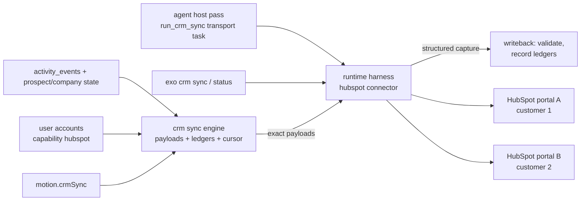

# Per-motion CRM activity sync (HubSpot first)

Status: locked for implementation.
Created: 2026-06-12. Locked: 2026-06-12. Revised: 2026-06-12, 8 Codex plan review rounds applied (see Revision log). Scope: Large (8-round cap; reclassified from Medium after round 5 kept surfacing real P1s).

The operator works prospects in Exo while customer-facing reporting lives in each customer's CRM — today that is HubSpot, fed by Audienti V10's sync. Exo records rich activity locally (`activity_events`) but pushes nothing to any CRM, so prospects worked in Exo are invisible to the HubSpot reports and analytics that are keyed off V10's `audienti_*` contact properties and note stream. This plan adds an automatic, backend CRM sync configured **per motion** — different motions can push to different connected CRMs (different customers) — that reuses V10's exact key structures (property names, note format, source-key scheme) so a prospect worked in both systems shows as one contact with one activity stream. It is deliberately *not* migration-compatible: Exo never imports V10's sync state; convergence happens through shared lookup keys.

Citation convention: Exo paths are relative to this repo. V10 paths are prefixed `v10:` and are relative to `/Users/williamflanagan/Projects/omalab/v10`. After first mention, V10's HubSpot service files are cited by basename — `configuration.rb`, `prospect_payload.rb`, `sync_account_prospect.rb`, `sync_timeline_notes.rb`, `properties_bootstrap.rb`, `missing_property_retry.rb` all live in `v10:app/services/integrations/hubspot/`.

## Current behavior (verified in code)

Exo side:

- Motions are a Zod schema with no integrations block; per-motion assignment precedent exists at `engagementUserAssignment` (nullable, default null) (`src/schema/motion.js:33-62`).
- All prospect activity lands in the `activity_events` table: unique `dedupe_key`, `kind` in (`touch`,`timeline_note`,`system`), `surface`/`direction`/`outcome`, `occurred_at`, `payload_json` (`src/db/migrations.js:260-285`). Touches are appended via `appendActivityEvent` with `dedupeKey` = `` `touch:${motion.id}:${prospect.id}:${touch.id}` `` (`src/core/record-prospect-touch.js:50-63`); read side is `listActivityEvents` (`src/db/activity-events.js:117`).
- Touch surfaces are a 20-value enum (`connection_request`, `post_accept_message`, `follow_up_direct_message`, `email`, `inbound_reply`, `public_comment`, `comment_reply`, `profile_view`, `follow`, `unfollow`, `like_post`, `unlike_post`, `share_post`, `in_mail_message`, `withdraw_connection`, `accept_connection`, `decline_connection`, `create_comment_reaction`, `voicemail_outreach`, `video_outreach`) with `direction` (`outbound`,`inbound`,`system`) and an 8-value `outcome` enum (`src/schema/target-account.js:20-52`).
- Identity: `people` has unique partial indexes on `linkedin_member_id`, `linkedin_public_id`, `primary_email` (`src/db/migrations.js:159-175`). `prospects` is unique on `(motion_id, person_id)` (`src/db/migrations.js:250`). `companies` carries `domain`, `linkedin_company_url`, `website_url` (`src/db/migrations.js:27-40`). Prospect dispositions: `active`, `nurture`, `not_a_fit`, `no_longer_target`, `exhausted` (`src/db/migrations.js:239-241`).
- HubSpot already exists as a **connector capability**, with no sync engine behind it:
  - `hubspot` is a first-class capability in `browserProfileCapabilitySchema` (`src/schema/browser-profile.js:5-12`), accepted across the users/companies/profiles CLI (`src/cli/commands/users.js:372`, `src/cli/commands/companies.js:352`, `src/cli/commands/profiles.js:153` — example ref `hubspot:client-main`).
  - Runtime connector discovery handles `connector === "hubspot"` via Codex apps linked accounts (namespace `codex_apps__hubspot`, identity noun "portal") (`src/core/discover-runtime-account-identities.js:67-77`); harness-connection probing knows the connector id `hubspot@openai-curated` (`src/core/probe-user-harness-connections.js:23`); user intake lists `hubspot` among codex runtime connectors (`src/core/build-user-intake.js:8`); browser profiles can carry verified HubSpot auth signals (cookie/history probes for `app.hubspot.com`, `src/lib/browser-profiles.js:444-447`); onboarding renders a HubSpot connect card (`src/artifacts/render-onboarding.js:299-385`).
  - Per-capability execution resolution already answers "which hubspot account executes for this company/motion": `exo companies execution show --capability hubspot` (`src/cli/commands/companies.js:352`), backed by `resolveUserConnection` (`src/core/resolve-user-connection.js:25`) and `resolveScopedExecutionAssignment`, which already reads `motion.engagementUserAssignment?.accountRefs` per capability (`src/core/resolve-scoped-execution-assignment.js:72`, `177-217`); the assignment schema carries `accountRefs` today (`src/schema/company.js:21-30`). The remaining motion-account-selection workstreams (#47-50: write-time one-ref-per-family validation, intake question, settings UI, visibility) are open tickets layering on this resolver — this plan depends on the resolver as it exists, and on #47's write-time validation for W1's invariant; if #47 has not landed first, W1 enforces the hubspot-ref write-time check itself.
  - Agents already use the HubSpot connector ad hoc during contact enrichment ("no hubspot records" notes, `src/core/planner-support-actions.js:204`).
- The Gmail connector shows the established external-service execution pattern: Exo never holds credentials or calls provider APIs natively; tasks execute through the runtime harness (codex binary, `scripts/run-agent-host-pass.js:72-145`) using connectors configured outside Exo, and results come back as structured captures that Exo validates strictly on writeback (`buildGmailInboundSyncPayload` + `gmailInboundSyncCaptureSchema`, `src/core/inbound-gmail-sync.js:13-60`).
- Recurring backend work runs through the agent host pass: queue built by `buildAgentQueue` with task kinds like `run_inbound_sync` (`src/core/build-agent-queue.js:1394-1395`), executed in transport/research lanes with leases/budgets by `scripts/run-agent-host-pass.js`.
- The migration runner only supports the v1 baseline: with a v1 database on disk, adding a migration with a higher version trips `assertNoPre03Ledger`, which throws `ReinitializeRequiredError` whenever `user_version > 0` and the version is not `CURRENT_SCHEMA_VERSION` (`src/db/migrations.js:318-360`). Any plan adding tables must first make the runner support additive migrations.
- There is no CRM *sync* code anywhere in Exo today — no contact/company upsert, no activity push, no sync ledger.

V10 side (the contract to match):

- Contact upsert: lookup candidates are `email` then `audienti_record_url`, in that order, skipping blanks (`v10:app/services/integrations/hubspot/prospect_payload.rb:30-41`); upsert flow is stored-id update → candidate search → create, with `audienti_skip_requested=false` seeded on create (`v10:app/services/integrations/hubspot/sync_account_prospect.rb:60-67`, `253-290`). Contact creation requires email or name (`prospect_payload.rb:26-28`); blank/empty properties are stripped before write (`sync_account_prospect.rb:292-296`).
- Contact properties: standard `email`, `firstname`, `lastname`, `jobtitle`, `company`, `website`, `phone` plus 30 custom properties, all prefixed `audienti_` and defined (name, type, fieldType, options, groupName `contactinformation`) in `v10:app/services/integrations/hubspot/configuration.rb:18-278`. Reporting properties written on every sync include `audienti_touch_count`, `audienti_engage_count`, `audienti_intent_score`, `audienti_targeting_status` (`active`/`inactive`/`rejected`), `audienti_targeting_inactive_reason` (`nurture`/`non_responsive`/`not_fit`/`delayed`), `audienti_pipeline_stage`, and per-stage timestamps (`prospect_payload.rb:116-144`).
- Pipeline stage values (`crm_value`) come from a YAML catalog: `identified`, `pre_connect`, `connect_request`, `connected`, `engaged`, `meeting_requested`, `meeting_outcome_accepted`, `meeting_outcome_declined`, `cancel` (`v10:config/data/prospect_stages.yaml`).
- Company upsert: lookup by `domain` only; skipped with an event when domain is blank; properties `name`, `domain`, `website`, `industry`, `phone` plus 5 `audienti_*` customs (`sync_account_prospect.rb:114-130`, `configuration.rb:280-316`). Contact↔company associated via default association (`sync_account_prospect.rb:70-77`).
- Activity stream: HubSpot **Notes API** objects with exactly two properties, `hs_timestamp` (UTC ISO8601) and `hs_note_body` (HTML) (`v10:app/services/integrations/hubspot/sync_timeline_notes.rb:163-173`). Body structure: `<strong>` headline, `
---
` divider, detail lines (`Direction`, `Platform`, `Event type`), a `<ul>` metadata list (type-specific ID, "Open in Audienti" link, "Open source" link, "Tracked profile" link — each omitted when blank), optional 200-char text preview (`sync_timeline_notes.rb:175-198`). The `Event type` value is the event key with dots replaced by underscores (e.g. `action_profile_connect_request_sent`) (`sync_timeline_notes.rb:280-282`).
- Headlines come from the `ACTION_HEADLINES` map (`action.post.like` → "Liked post", `action.profile.connect_request_sent` → "Sent connection request", etc.) (`sync_timeline_notes.rb:17-41`).
- Note idempotency: per-activity `source_key` of the form `{type}:{id}` (`event:`, `post:`, `comment:`, `reaction:`, `provenance:`) (`sync_timeline_notes.rb:349-366`), tracked in a ledger table unique on `(account_integration_id, account_prospect_id, source_key)` storing `hubspot_note_id` and `payload_digest` = `SHA256("{iso8601 ts}\n{body}")`; unchanged digests are skipped, changed digests update the existing note (`sync_timeline_notes.rb:116-151`, `171`).
- Note associations: contact association type id `202`, company `190`, both `HUBSPOT_DEFINED` (`sync_timeline_notes.rb:11-12`, `510-538`). After any note create/update, contact metric properties are re-pushed (`sync_timeline_notes.rb:70`, `575-587`).
- Excluded from sync: event key `note.steer`; event states `pending`,`queued`,`processing`,`rate_limited`,`delayed`,`retried`,`failed`,`error`,`skipped`; hidden/private/system events (`sync_timeline_notes.rb:13-14`, `106-114`).
- Connection: one integration per V10 account, private-app token stored encrypted, `auto_sync_enabled` flag in metadata; on connect, property definitions are bootstrapped and a full backfill is enqueued (`v10:app/services/integrations/hubspot/connect_account.rb:104-126`).
- Field setup is explicit and verified, not assumed: `PropertiesBootstrap` provisions every contact/company definition, treats 409 as "exists" and reconciles drift (projects the live property onto the expected definition's keys; updates it on mismatch), then persists `hubspot_properties_signature` (SHA256 of the catalog JSON, `v10:configuration.rb:334-353`) + checked-at on the integration (`v10:app/services/integrations/hubspot/properties_bootstrap.rb:17-68`). Every sync calls `ensure_properties_bootstrapped!` (no-op while the stored signature matches), and writes are wrapped in `missing_property_retry`: a `PROPERTY_DOESNT_EXIST` / malformed-boolean error forces a re-bootstrap and retries once (`v10:app/services/integrations/hubspot/missing_property_retry.rb:8-53`). Pacing budgets against HubSpot's 5 req/s search limit (~4 req/s effective, 2 s dispatch interval); 429s retried up to 10 times with 2-minute waits (`v10:app/services/integrations/hubspot/sync_dispatcher.rb`, `v10:app/jobs/integrations/hubspot/sync_account_prospect_job.rb:6-18`).
- `audienti_skip_requested` is a documented inbound control flag: "Set to Yes in HubSpot to request that Audienti stop prospecting this contact" (`configuration.rb:75-83`).

## Decisions

Locked by operator decision, 2026-06-12:

- **Key structures are V10's, verbatim — including the `audienti_` prefix.** Exo writes the same property internal names, types, enum option values, and group names as `v10:configuration.rb`; the same Notes shape (`hs_timestamp` + HTML `hs_note_body` with V10's section structure, headlines, and underscore `Event type` strings); and the same `{type}:{id}` source-key scheme and SHA256 digest formula. Why: HubSpot reports and analytics are keyed off these exact strings; a prospect worked in both systems must read as one activity stream. Consequence: no `exo_*` property namespace; Exo's note builder is a port of `sync_timeline_notes.rb`, not a redesign.
- **Sync is configured per motion; connections are defined once per workspace.** A motion opts into exactly one named CRM connection; multiple motions may share a connection, and different motions may use different connections (different customers' portals). Why: the user-stated requirement — multiple CRMs connected concurrently, synced automatically in the backend. Consequence: all sync ledger state is keyed by connection, not globally.
- **Not migration-compatible, by design.** Exo never reads or imports V10's `hubspot_object_id` / ledger rows. Identity convergence happens in HubSpot through the shared lookup keys (email first). Why: the systems stay decoupled; matching keys is sufficient for the one-contact/one-stream outcome.
- **One-way push (Exo → CRM) for v1, with the single exception of the `audienti_skip_requested` read-back (see pending decision).** No HubSpot→Exo field sync, no contact imports. Why: the deliverable is reporting/visibility parity, not two-way CRM sync.
- **Companies sync and associate exactly as in V10.** Domain-keyed company upsert, contact↔company default association, company association on notes when present. Why: HubSpot company-level rollups are part of the existing reporting.
- **HubSpot is the only v1 provider, behind a provider-shaped config.** Connection entries carry `provider = "hubspot"`; the sync engine isolates HubSpot specifics in one client module so a second provider is additive. Why: the requirement says "a CRM (like HubSpot)"; HubSpot is the only one with a defined key contract today.
- **No native CRM integration — portals connect outside Exo, like Gmail (locked 2026-06-12).** Exo stores no CRM tokens and ships no HubSpot HTTP client. A portal is connected in the runtime harness (Codex apps connector `hubspot@openai-curated`), discovered through the existing connector machinery (`src/core/discover-runtime-account-identities.js:67-77`), and attached to a user as a **managed** connected account with capability `hubspot` and a claimed exact identity — browser-profile HubSpot evidence informs onboarding but is not a governed execution path (`src/core/resolve-user-connection.js:83`). All CRM API calls execute through the runtime harness as agent-host tasks, mirroring the Gmail pattern: Exo pre-builds exact payloads, the runtime's connector performs the calls, and Exo validates structured captures on writeback. Why: operator decision — "connectors like we do with gmail, outside of the app; we shouldn't have it natively built in"; this also keeps Exo's no-vendor-SDK posture intact. Consequence: W1's config registry and W2's HTTP client (as originally sketched) are out; W2 becomes a payload-builder + capture-validator module, and sync runs in the transport lane.
- **Sync runs as an agent-host transport task plus a manual CLI path (locked 2026-06-12, follows from the connector decision).** A `run_crm_sync` task kind is emitted per motion with pending work; `exo crm sync` runs the same engine on demand. Why: "backend sync happens automatically" requires the pass loop; the connector execution model puts it in the transport lane next to sends.
- **Pacing and retry follow V10's budget.** ~4 effective req/s per portal, serial dispatch per portal, 429 retry with backoff — enforced through per-pass task budgets and ledger-backed retry state rather than an in-process HTTP throttle. Why: same portal-level rate limits apply; V10's budget is proven against them.

- **The sync destination is the motion's `hubspot` accountRef — no second account authority (locked 2026-06-12).** The hubspot ref carried in the motion assignment's `accountRefs` (one per capability family, the motion-account-selection contract) is the destination portal; `motion.crmSync` carries only enable/scope toggles and the destination resolves through the existing scoped-execution machinery (`resolveUserConnection`, `src/core/resolve-user-connection.js:25`). Why: one account authority; the resolution path and CLI surface (`exo companies execution show --capability hubspot`) already exist. Consequence: the portal account must be attached to the user/persona assigned to the motion; enabling sync without a resolvable hubspot ref fails at write time with a connect/attach next move.
- **Contact identity keys are `email` then `audienti_linkedin_url`; never `audienti_record_url` (locked 2026-06-12).** Lookup order: `email` (from `people.primary_email`), then `audienti_linkedin_url` — the property V10 writes on every contact it syncs, so cross-system convergence works for email-less LinkedIn prospects. Creation requires at least one of the two keys; keyless prospects are skipped with a ledger record. `audienti_record_url` is V10's hosted prospect URL and has no Exo equivalent — Exo neither writes it nor looks it up. Why: email is the shared primary key; LinkedIn URL is the only other identifier both systems reliably hold. Consequence: W3 must normalize LinkedIn URLs to V10's canonical form (`v10:prospect_payload.rb:421-431`) before lookup, or string-equality search silently misses and duplicates.
- **v1 activity scope is touches + signals + status changes (locked 2026-06-12).** Three event classes sync as notes: (1) all `kind='touch'` activity events (outbound actions and inbound replies, 20 surfaces); (2) signal context — prospect-level `liveSignal` / `publicEngagementSelection` snapshots and company-level `signal_matches` rows, V10's `post:`/`provenance:` note style; (3) prospect disposition transitions, which already land as `kind='system'` activity events with payload `{type: "disposition_changed", from, to, reason, actor}` (`src/db/prospects.js:368-388`), mapped to V10's `action.prospect.*` keys ("Moved prospect to nurture", etc.). Why: operator decision — the HubSpot timeline should carry outreach, the signal context behind it, and lifecycle moves like nurture, matching what V10 customers see today. Consequence: the W4 eligibility filter includes `kind='system'` events of type `disposition_changed` (other system events stay excluded), and `motion.crmSync` drops the scope knob — scope is fixed v1 behavior.
- **Disposition → reporting-property mapping (locked 2026-06-12).** `active`→`active`; `nurture`→`inactive`+reason `nurture`; `not_a_fit`→`inactive`+reason `not_fit`; `exhausted`→`inactive`+reason `non_responsive`; `no_longer_target`→`rejected` (stamps `audienti_rejected_at`). `audienti_pipeline_stage` derives from touch history (first pre-connect touch → `pre_connect`, first `connection_request` → `connect_request`, accepted connection → `connected`, then `engaged` on V10's full engaged-evidence set — any inbound message, inbound comment, inbound comment-reply/react, OR an inbound profile view, i.e. `messaging.message_received`/`action.post.comment.*.inbound`/`action.profile.view.reply`, matching `v10:app/services/prospects/pipeline_state_resolver.rb:31-37,153-161`), capped at `engaged` until meeting-state events exist (issue #62); default `identified`. Why: operator confirmed — exhausted reads as non-responsive in reports, no_longer_target is the terminal removed-from-targeting state. Consequence: W3's payload builder implements exactly this table; meeting-stage values never appear in v1 writes even though the property options are bootstrapped.
- **Field setup is a gated, re-verified step — no writes against unverified portals (locked 2026-06-12).** Before any contact/company/note write, the portal's stored properties signature must match the catalog signature; when it doesn't (first enable, Exo upgrade that changes the catalog, or a reinitialized workspace database), a bootstrap-verify task runs first: create missing definitions, reconcile drifted ones exactly as V10 does (`v10:properties_bootstrap.rb:27-68`), persist signature + checked-at per portal. Mid-write missing-property errors force a re-bootstrap and a single retry (V10's `missing_property_retry` contract). Why: operator directive — the fields must exist and be correct before we write, including after reinitialization; silently writing into a portal with missing/drifted fields corrupts the reporting the whole plan exists to feed. Consequence: W2 adds a `crm_connection_state` table carrying the per-portal signature, checked-at, cursor, and pause state.
- **`audienti_skip_requested` is honored as a suppression cue (locked 2026-06-12).** The identity-sync capture includes the contact's current `audienti_skip_requested` value; when true, writeback records a suppression cue (the `inbound_cues` pattern, `src/db/migrations.js:94-114`) for operator disposition — no automatic state change. Why: V10 documents the flag as a customer-facing control ("stop prospecting this contact", `v10:configuration.rb:75-83`); ignoring it breaks customer trust, but mutating prospect state directly off external data without review is worse. Consequence: W5 owns the cue surfacing; resolving the cue (operator sets a disposition) flows back to HubSpot as a normal status change on the next sync.
- **Tickets: one epic + five workstream issues (locked 2026-06-12).** A `type:epic` ticket referencing this plan, plus one issue per workstream (W1–W5) carrying its acceptance lines — the Motion-account-selection / Freshness convention (#36 + #47-50, #34 + #51-57). Why: GitHub tickets are the source of truth; plan docs are spec.

## Semantics to lock

- A **CRM connection** is a **managed harness-backed** connected account with capability `hubspot` whose identity is claimed to one exact portal. Browser-profile HubSpot evidence is not a governed execution path — resolution returns `unsupported` for profile-backed accounts (`src/core/resolve-user-connection.js:83`), and a managed account without an exact external identity resolves `identity_unresolved` (`src/core/resolve-user-connection.js:594-607`). A **motion sync assignment** (`motion.crmSync`) enables sync against exactly one such resolved account; null means "this motion never talks to a CRM" and must emit zero CRM tasks anywhere in the pipeline.
- **The ledger `connection_key` is the verified HubSpot portal id, not the handle and not the connector link id.** Codex-apps discovery returns `providerAccountId` = `link.linkId ?? link.connectorId` with `handle: null` and `identityState: "unresolved"` — the runtime does not expose which portal a link represents (`src/core/discover-runtime-account-identities.js:206-229`) — and link ids are not proven stable across reconnects, so keying durable ledgers off them would fork all sync state when a portal is re-linked. `connection_key` = `hubspot:{portalId}` where `portalId` is the HubSpot hub id fetched **through the connector itself** (account-info) during the claim/verify flow, persisted in two places — `account.metadata.crm.portalId` on the resolved managed account (the durable map from a motion's accountRef to its portal, so offline scheduling needs no prior key) and `crm_connection_state` (the portal-scoped ledger home) — and re-asserted by every bootstrap-verify: a re-linked portal resolves to the same key and its ledgers survive; a portal-id mismatch pauses the connection for operator action (it is a different portal, not a reconnect).
- **Cursors are per `(connection, motion)` and are `(recorded_at, id)` pairs, not bare timestamps.** `appendActivityEvent` stamps `recorded_at` from wall clock (`src/db/activity-events.js:29-46`), so equal timestamps are routine within a pass; the cursor advances on the keyset pair with ascending scan and id tie-break, never skipping or double-reading collisions. Each motion's sync task advances only its own cursor row, so two motions sharing a portal can never skip each other's pending work. Portal-scoped facts (portal id, properties signature, pause/backoff) live once per connection.
- **Shared-contact property authority is the owning prospect, with a deterministic inactive fallback.** Exo already enforces a single active owner motion per person across motions: a second motion's prospect for the same person is parked `held_cross_motion` with a `crossMotionOwner` (`src/core/record-prospect.js:348`), released only when the owner motion deactivates (`src/db/prospects.js:438-460`). Contact reporting properties (`audienti_targeting_status`, `audienti_pipeline_stage`, counts, timestamps) are computed from the authority prospect: the active, non-held prospect when one exists; otherwise — the state that exists the moment a sole prospect moves to `nurture`/`not_a_fit`/`no_longer_target`/`exhausted` and the inactive properties still must be written — the non-held prospect with the latest `disposition_at` (tie-break `updated_at`, then `id`). Held prospects never drive property writes. Notes are per-event and unaffected — all motions' notes interleave on the shared contact.
- **Identity is per `(connection, person)`, not per prospect.** A person worked in two motions that share a connection resolves to one HubSpot contact; the object-link ledger is unique on `(connection, person_id)`. Companies: `(connection, company_id)`.
- **Activity is per `(connection, source)`; the ledger is unique on `(connection, source_key)`.** Source-key grammar (same `{type}:{identifier}` shape as V10, identifier spaces disjoint from V10's integer ids so a shared portal can never collide):
  - `event:{activity_events.id}` — touches and disposition-change events (UUIDs).
  - `signal:{signal_matches.id}` — company-level signal matches (UUIDs).
  - `signal:{prospect_id}:{sha256(url ?? channel+observedAt)[:16]}` — prospect-level signal snapshots (`liveSignal`, `publicEngagementSelection`), which carry no stable row id; the prospect id prefix prevents cross-prospect collisions on a shared post URL.
- **The `Event type` strings are part of the public contract.** Exo maps each touch surface to a V10 event key (W4 table); where a concept exists in V10's `ACTION_HEADLINES`, Exo emits the identical key and headline. Exo-only concepts get new `action.*` keys in the same dotted grammar.
- **A portal is writable only while its stored properties signature matches the catalog.** Absent or stale signature (first enable, catalog change, reinitialized database) gates all write tasks behind a bootstrap-verify pass; a mid-write missing-property signal invalidates the signature and re-gates.
- **Eligibility boundary is the sync engine, not the recorder.** `appendActivityEvent` stays sync-agnostic; the CRM engine filters (kind, direction/outcome exclusions, motion assignment) at read time off the `(connection, motion)` cursor on `crm_motion_sync_state`, plus ledger-diff for state-derived signal sources.

## Target shape

Exo computes V10-keyed payloads and tracks ledgers; the runtime harness's connector performs the actual HubSpot calls per motion-resolved portal; writeback validates captures and records sync state. Nothing in Exo holds CRM credentials.

## Non-goals

- Native CRM clients, token storage, or a connection registry in Exo config. Portals connect through the existing runtime-connector and browser-profile flows; this plan only consumes them.
- Two-way sync. HubSpot edits (other than the pending `audienti_skip_requested` decision) never flow into Exo.
- Importing V10 sync state, contacts, or note ledgers. "Not migration compatible" is a feature.
- HubSpot deals, lists (`v10:app/models/hubspot_list_sync.rb` has no Exo counterpart in v1), custom timeline event templates, or marketing events.
- Other CRM providers (Salesforce, Close, etc.) — config is shaped for them; implementation is HubSpot-only.
- Per-prospect or per-company sync overrides within a motion. The motion is the sync boundary.
- Meeting-stage properties (`audienti_meeting_*`) until meeting-state events exist in Exo (issue #62); the property definitions are still bootstrapped for schema parity.

## W1: Per-motion sync config on the existing connector rails

Why this matters: the motion is the sync boundary — without a clean per-motion assignment that resolves through the existing account machinery, multi-customer sync either hard-codes one global CRM or invents a second account authority, contradicting the motion-account-selection plan's locked "motion is the only account authority" principle.

Work:

1. Add `crmSync` to the motion schema (`src/schema/motion.js:33-62`): nullable object `{ enabled: boolean }`, default null, following the `engagementUserAssignment` precedent at line 61. The destination is implicit: the motion assignment's `hubspot` accountRef (locked decision above). Activity scope is fixed v1 behavior (locked decision above), not per-motion config.
2. Destination resolution: resolve the motion's hubspot account through the existing per-capability machinery (`resolveUserConnection` in `src/core/resolve-user-connection.js:25`, scoped execution assignment as surfaced by `exo companies execution show --capability hubspot`, `src/cli/commands/companies.js:352`). Enabling sync on a motion with no resolvable hubspot account fails at write time with the existing "next move" pattern (connect a portal / attach the account), not silently at sync time.
3. CLI: `exo motion crm set|show|clear --motion <id>` (enable/inspect/disable sync; validates destination resolvability at write time), and `exo crm status` (per-portal ledger state — last synced, errors, pending counts). Register under a new `registerCrm` command module following the `src/cli/commands/agent.js:39-66` pattern. Portal connection itself stays in the existing flows (`exo users accounts add --capability hubspot`, onboarding card) — this plan adds no connection UI.
4. Write-time invariant, owned by this plan (not deferred to #47): enabling `crmSync` validates that the motion assignment carries at most one `hubspot` ref AND that it resolves to a managed account with a claimed `providerAccountId`. Today no write-time enforcement exists — `assignMotionUser` defaults `accountRefs` to *every* account ref on the user when none are given (`src/core/assign-motion-user.js:55-68`), and multi-ref ambiguity only surfaces later as `identity_ambiguous` during resolution (`src/core/resolve-scoped-execution-assignment.js:227`). The enable path fails closed on: no hubspot ref, more than one, profile-backed (`unsupported`), unclaimed identity (`identity_unresolved`), or no verified portal id. The portal-id claim is part of enable: `exo crm test`/the enable flow runs a connector task that fetches the portal's account-info, then **persists the verified hub id onto the resolved managed account itself** — `metadata.crm = { portalId, verifiedAt }` on `userConnectedAccountSchema`, which already carries a free-form `metadata` record (`src/schema/user.js:95`) — in addition to seeding `crm_connection_state`. This account-side claim is what makes offline scheduling non-circular (W5 item 1): a state-based queue pass maps a motion → its assigned `hubspot` accountRef → that account's `metadata.crm.portalId` → `connection_key = hubspot:{portalId}`, with no prior knowledge of the key. The current resolver's "any non-null `providerAccountId` is an exact identity" rule (`src/core/resolve-user-connection.js:549`) is not sufficient for durable ledger keying, since discovery fills `providerAccountId` with the connector link id (`src/core/discover-runtime-account-identities.js:206-229`); the `metadata.crm.portalId` claim is the durable CRM identity, the link id stays only as the runtime's connector handle.

## W2: Additive migrations, ledger tables, payload/capture contract

Why this matters: the migration runner cannot currently add tables to a live v1 database (`src/db/migrations.js:352-360` throws `ReinitializeRequiredError` for any `user_version > 0` ≠ current) — shipping sync without fixing this bricks every existing workspace. And because the runtime harness executes the actual API calls, the payload builder and capture validator ARE the contract — sloppy schemas here mean silent key drift in customer portals.

Work:

1. Rework `assertNoPre03Ledger` to only reject true pre-0.3 ledgers (`user_version === 0` with user tables present), allowing version 1 → 2 additive migration (`src/db/migrations.js:318-360`).
2. Migration 2 adds four new tables (below) **and alters `inbound_cues`** to carry the CRM skip cue: add `connection_key` and `person_id` columns plus an index on `(connection_key, person_id, cue_status)` (today the table has only `user_id`/`account_id`/`motion_id`/`company_id`/`prospect_id`, `src/db/migrations.js:94-114`). Extend `inboundCueSchema` (`src/schema/inbound.js:164-182`), `upsertInboundCue` (`src/db/database.js:380-449`), and `listInboundCues` (`src/db/database.js:495-551`) to persist and filter the two new columns. For `crm_skip_requested` cues, ownership is `(connection_key, person_id)`; `user_id`/`account_id`/`motion_id`/`prospect_id` are incidental routing metadata only (which operator queue to surface in, recomputed, not authority). The four new tables, all provider-agnostic with a `connection_key` column (= `hubspot:{portalId}` per the Semantics):
   - `crm_connection_state`: `(connection_key PK, portal_id, properties_signature, properties_checked_at, paused_at, pause_reason, last_synced_at, last_error_at, last_error_message)`. Per-portal home for the verified portal identity, the field-verification signature (V10 keeps it in integration metadata, `v10:properties_bootstrap.rb:37-50`), and pause state. Deliberately **account-agnostic**: the account model allows multiple users to hold managed accounts for the same portal (`src/schema/user.js:75`, per-user dedupe only in `src/core/upsert-user-harness-connection.js:76`), so the executing account resolves per motion at task-build time via the motion's assignment; motions whose accounts claim the same portal id share this row and all its ledgers — that is the desired dedup, not an error. No cursor here — cursors are per `(connection, motion)`.
   - `crm_motion_sync_state`: `(connection_key, motion_id, cursor_recorded_at, cursor_event_id, backfill_completed_at, last_synced_at)`, unique `(connection_key, motion_id)`. The cursor is a `(recorded_at, id)` keyset pair — `recorded_at` is wall-clock and collides routinely within a pass (`src/db/activity-events.js:29-46`), so bare-timestamp cursors would skip or double-read equal-stamp events. Each motion's task advances only its own cursor, so motions sharing a portal cannot skip each other's pending events. Signal sources need no cursor: they are state-derived, and the activity ledger itself is the dedup authority (a candidate signal key absent from `crm_activity_syncs` is pending).
   - `crm_object_links`: `(connection_key, object_kind 'contact'|'company', person_id|company_id, crm_object_id, authority_prospect_id, properties_fingerprint, last_synced_at, last_error_at, last_error_message)`, unique `(connection_key, object_kind, local_id)`. Mirrors V10's `hubspot_object_id` + error columns on `account_prospects`, plus the property-dirtiness state: `authority_prospect_id` is the prospect that last drove property writes, and `properties_fingerprint` is a SHA256 over the full W3 property-input set. Identity sync is pending whenever the recomputed authority or fingerprint differs from the stored values — this catches both ownership transfers (a pure `cross_motion_hold_released` changes the authority without any disposition event, `src/db/prospects.js:438-475`) and enrichment edits that append no activity event (`exo companies prospects update` → `updateMotionProspect` persists contact points/titles silently, `src/cli/commands/companies.js:1075`, `src/core/record-prospect.js:543-686`).
   - `crm_activity_syncs`: `(connection_key, source_key, activity_event_id, person_id, crm_note_id, payload_digest, last_synced_at, last_error_at, last_error_message)`, unique `(connection_key, source_key)`. Mirrors `v10:app/models/hubspot_timeline_note_sync.rb`'s table.
3. Property catalog module porting `CONTACT_PROPERTIES` / `COMPANY_PROPERTIES` verbatim from `v10:configuration.rb:18-316` as data (the `audienti_pipeline_stage` options enumerate the nine `crm_value`s from `v10:config/data/prospect_stages.yaml`), with a computed catalog signature (SHA256 over the normalized definitions, V10's formula at `v10:configuration.rb:334-353`).
4. Bootstrap-verify task (the setup gate): when a portal's stored signature is absent or stale — first enable, catalog change on Exo upgrade, or a reinitialized workspace database — emit a bootstrap task before any write task: fetch the portal's account-info and assert the hub id against `crm_connection_state.portal_id` (mismatch → pause, different portal), list existing portal properties, create missing definitions, reconcile drifted ones against the catalog (project-and-compare then update, `v10:properties_bootstrap.rb:59-85`), and persist portal id + signature + checked-at to `crm_connection_state` — and the `metadata.crm.portalId` claim onto the resolved managed account (W1 item 4) so offline scheduling can recover `connection_key` — on writeback. Write tasks for a portal are not emitted while its signature is unverified; `exo crm test --motion <id>` runs the same verification on demand and reports per-field state.
5. Task payload + capture schemas (the Gmail-pattern contract, cf. `gmailInboundSyncCaptureSchema` usage in `src/core/inbound-gmail-sync.js:13-60`): Zod schemas for each CRM operation batch (bootstrap-verify, upsert contact, upsert company, associate, create/update note) carrying exact property maps and note bodies the runtime must apply **verbatim**, and a capture schema for results (crm object ids, note ids, per-item status, rate-limit/auth/missing-property signals) that writeback validates strictly. Verbatim fidelity is part of the task instructions; ledger digests are computed from the intended body so unintended drift re-pushes on the next pass.
6. Pacing + retry at the task layer: per-pass batch caps sized against HubSpot's 5 req/s search limit (~4 effective req/s, V10's proven budget), rate-limit signals in the capture defer the remainder to the next pass with backoff state on the ledger rows; auth failures pause the portal's tasks with an operator-actionable message. Missing-property parity with V10's `missing_property_retry` (`v10:missing_property_retry.rb:8-53`): a capture reporting `PROPERTY_DOESNT_EXIST` (or malformed-boolean) marks the portal's signature stale, re-queues bootstrap-verify, and retries the failed batch once on the next pass.

## W3: Identity sync — contacts and companies

Why this matters: the one-contact guarantee lives here. A wrong lookup order or a create-without-keys produces duplicate contacts that poison the customer's reports — V10's exact failure mode this contract exists to prevent.

Work:

1. `src/core/sync-crm-identity.js`: build the contact upsert batch for a `(connection, person)` encoding V10's flow (`v10:sync_account_prospect.rb:253-290`) as explicit task steps the runtime executes: stored link id → update; else search candidates in order; else create (seeding `audienti_skip_requested=false`); blank properties stripped before write. Writeback records returned object ids on `crm_object_links`.
2. Lookup candidates per the locked identity decision: `email` from `people.primary_email`, then `audienti_linkedin_url` from the person's LinkedIn URL **normalized to V10's canonical form** (https scheme, canonicalized host/path — `v10:prospect_payload.rb:421-431`) so property-equality search matches V10-written values. Create-gate: refuse creation with neither key, recording a skip on the ledger row.
3. Property payload builder — the complete field-by-field contract for every contact property Exo writes in v1 (V10's full reporting set at `v10:prospect_payload.rb:99-144`, `160-174`):
   - Standard: `email`, `firstname`/`lastname` (name parts), `jobtitle`, `company`, `website`, `phone` (best `phone` contact point by verification status — `verified` over `observed`; the kind exists in the contact-point schema, `src/schema/target-account.js:74`; stripped when absent, matching V10's `preferred_phone`, `v10:prospect_payload.rb:20-24`).
   - URLs: `audienti_linkedin_url` (canonical form), `audienti_website_url`, `audienti_primary_social_url` (= linkedin url fallback chain).
   - Engagement: `audienti_last_engagement_at`/`_type`/`_source` (latest inbound activity event; `_type` = its mapped event key), `audienti_touch_count` (count of outbound touch events), `audienti_engage_count` (count of inbound events).
   - Targeting: `audienti_targeting_status` from the locked disposition mapping; `audienti_targeting_inactive_reason` (only while `inactive`); `audienti_targeting_status_changed_at` = the prospect's `disposition_at`; `audienti_skip` = true iff status is `inactive` (V10 rule, `v10:prospect_payload.rb:322-324`); `audienti_nurtured_at`/`audienti_rejected_at`/`audienti_restored_from_nurture_at` from the matching disposition-change events; `audienti_connection_request_withdrawn_at`/`audienti_unfollowed_at` from the matching touch events.
   - Pipeline: `audienti_pipeline_stage` from touch history (locked mapping, capped at `engaged`; `audienti_engaged_at`/the `engaged` stage fire on the **first event in V10's engaged-evidence set**, not only an inbound reply — so an inbound profile view that emits an `action.profile.view.reply` note also advances the stage, keeping note and stage parity in lockstep), `audienti_pipeline_stage_entered_at` = `occurredAt` of the event that established the current stage, stage timestamps `audienti_pre_connect_at`, `audienti_connect_request_at`, `audienti_connected_at`, `audienti_engaged_at` from first matching activity events.
   - Never written in v1: `audienti_record_url` (no public record host; V10 itself refuses local hosts, `v10:prospect_payload.rb:392-419`), `audienti_intent_score` (Exo has no score), `audienti_meeting_*` (no meeting events until #62), `audienti_x_url` (Exo holds no X identity). Definitions are still bootstrapped for schema parity; blank values are stripped, never written as empties.
4. Company upsert keyed by `companies.domain` (skip-with-event when blank, matching `v10:sync_account_prospect.rb:214-229`), properties from `companies` columns/payload, then contact↔company default association.
5. Property authority for shared contacts (the Semantics rule): the builder computes reporting properties from the **owning** prospect — the active, non-`held_cross_motion` prospect for the person (`src/core/record-prospect.js:348`, `src/db/prospects.js:438-460`). Held prospects sync their notes but never drive property writes; ownership transfers are detected by the W5 recompute-and-compare rule (stored `authority_prospect_id` no longer matches), so the new owner's next sync re-derives the properties without needing any triggering event.

## W4: Activity sync — V10-parity notes

Why this matters: this is the visible activity stream. Format drift here (different headlines, different `Event type` strings, missing dedup) silently splits or duplicates the timeline customers read.

Work:

1. `src/core/sync-crm-activity.js`: per `(connection, motion)`, read `activity_events` past the motion's `(recorded_at, id)` cursor via a new ascending keyset query in `src/db/activity-events.js` — the existing `listActivityEvents` orders `occurred_at DESC, recorded_at DESC` (`src/db/activity-events.js:138`) and cannot provide stable read-after-cursor semantics — then filter to eligible events: `kind='touch'` excluding `outcome='pending'` (mirroring V10's pending-state exclusions, `v10:sync_timeline_notes.rb:13-14`), plus `kind='system'` events whose payload is `{type: "disposition_changed", subject: "prospect"}` (`src/db/prospects.js:368-388`); all other system events stay excluded. Signal sources (item 5) are read from prospect/company state alongside the event cursor.
2. Touch→event-key map, keyed by `(surface, direction, outcome)` — **not** surface alone, because Exo records failed attempts on the same surfaces as landed actions (e.g. an unavailable like is `like_post` with `touchOutcome: "blocked"`, `src/lib/action-result-catalog.js:118-126`; blocked DM threads likewise, `:70-80`). The map is derived from the action-result catalog's result entries (`src/lib/action-result-catalog.js`) and has three classes:
   - Landed actions (outcomes `sent`/`accepted`/`replied`/`opened-no-reply` — the last is a landed send that was read without reply): `connection_request`→`action.profile.connect_request_sent`, `withdraw_connection`→`action.profile.withdraw_connection`, `follow`→`action.profile.follow`, `unfollow`→`action.profile.un_follow`, `like_post`→`action.post.like`, `unlike_post`→`action.post.un_like`, `public_comment`→`action.post.comment`, `comment_reply`→`action.post.comment.reply.outbound`, `create_comment_reaction`→`action.post.comment.react.outbound`, `share_post`→`action.post.share`, `voicemail_outreach`→`action.voicemail.outbound`, `video_outreach`→`action.video.outbound`, outbound `profile_view`→`action.profile.view` ("Viewed Profile" — an existing V10 key, `v10:app/helpers/timeline_helper.rb:58-59`); **inbound** `profile_view` (outcome `opened-no-reply`, recorded today by `src/core/promote-inbound-person.js:75-82` for "they viewed your profile") → `action.profile.view.reply` ("Viewed Your Profile", `v10:app/helpers/timeline_helper.rb:62-63`); message-like surfaces map to V10's **channel-specific** message keys, not one generic key (V10 has none — `v10:app/services/events/create_message.rb:80-81`, `create_note.rb:38-39`, `create_action.rb:26`): `post_accept_message`/`follow_up_direct_message` (outbound LinkedIn DM) → `messaging.message_sent` ("Sent Direct Message"); `in_mail_message` (outbound InMail) → `action.profile.in_mail_message`; `email` outbound → `messaging.email_sent` ("Sent Email"); `inbound_reply` and any inbound message/email → `messaging.message_received` ("Received message" — V10 has no distinct inbound-email key, so inbound collapses here). The note headline stays generic ("Sent message"/"Received message") but the `Event type` line is derived from the specific key (`v10:sync_timeline_notes.rb:280-282`), so these keys are part of the locked public contract.
   - Inbound-invite handling — Exo's `accept_connection`/`decline_connection` mean *we* accepted/declined *their* inbound request (`inboundTransitionKind` `connection_request_accepted`/`_declined`, `src/lib/action-result-catalog.js:220-242`), so they map to V10's `action.profile.connect_request_accept` ("Accepted connection request") / `action.profile.connect_request_decline` ("Declined connection request") — NOT the `_accepted`/`_declined` variants, which mean the prospect accepted/declined ours. The prospect-accepted-ours event is the `connection_request` touch's outcome flipping to `accepted` (via reconcile), mapped to `action.profile.connected` ("Connected on LinkedIn").
   - Excluded, with explicit policy for every remaining outcome the writers accept (the touch CLI records all 8 outcomes, `src/cli/commands/companies.js:1818-1820`): `pending` and `blocked` attempt-failures (other than the explicit decline mapping above) emit no notes — the V10 analogue of its failed/skipped state exclusions; `ignored` emits no note (an ignored connection request is a real recorded state — `src/core/build-motion-action-view.js:254-258` keys withdraw availability off it — but it surfaces through pipeline-stage properties, and a later `withdraw_connection` touch emits its own note); `nurture` emits no note (the disposition-change event carries the nurture note). The implementation enumerates the full `(surface, direction, outcome)` table as data with an exhaustiveness test over the touch schema enums — every combination the writers can record has a map row or an explicit exclusion.
3. Disposition transition→event-key map: `→nurture`→`action.prospect.nurtured` ("Moved prospect to nurture"), `→not_a_fit`→`action.prospect.marked_not_fit` ("Marked prospect as not fit"), `→exhausted`→`action.prospect.marked_non_responsive` ("Marked prospect as non-responsive"), `→no_longer_target`→`action.prospect.rejected` ("Rejected prospect"), inactive`→active`→`action.prospect.restored_from_inactive` ("Restored prospect from inactive") — V10 keys and headlines verbatim from `v10:sync_timeline_notes.rb:32-37`. The transition's `reason` goes in the text preview.
4. Note builder porting `v10:sync_timeline_notes.rb:175-198`: headline (from `ACTION_HEADLINES` parity map), divider, Direction/Platform/Event type detail lines, metadata `<ul>` (`Event ID` = activity event UUID, `Open source` from touch `sourceUrl`; "Open in Audienti" omitted), 200-char preview from touch body/summary. HTML-escape everything.
5. Signal notes, V10's discovery-note style: prospect-level `liveSignal` and `publicEngagementSelection` snapshots (headline `Posted about "<topic>"` / "Post discovered", event keys `timeline.provenance.*`/`timeline.post.discovered`, `v10:sync_timeline_notes.rb:200-217`, `263-264`, `341-347`) keyed `signal:{prospect_id}:{digest}` per the source-key grammar; company-level `signal_matches` rows (`src/db/migrations.js:148-157`) as company-associated notes keyed `signal:{id}`, using V10's existing `action.company_signal.detected` event key (`v10:app/helpers/timeline_helper.rb:60-61`). Signal notes sync once per stable key — a refreshed snapshot with a new URL is a new note, not an update.
6. Idempotency: digest `SHA256("{iso8601}\n{body}")`, skip-on-match / update-on-change / create-otherwise against `crm_activity_syncs`, exactly as `v10:sync_timeline_notes.rb:116-151`. Activity events are append-only (`INSERT OR IGNORE`, `src/db/activity-events.js:48-58`) — there is no touch-edit path, so digest changes arise only from note-builder format revisions (an Exo upgrade that re-renders bodies updates existing notes in place rather than duplicating). Associations: contact 202 + company 190 (company-only for `signal_matches` notes).
7. After any created/updated note for a person, re-push contact reporting properties (mirrors `v10:sync_timeline_notes.rb:70`).

## W5: Automation, backfill, operability

Why this matters: "backend sync happens automatically" is the headline requirement; a sync that only runs by hand fails it. Silent failure is the second killer — the operator must see stuck connections without opening HubSpot.

Work:

1. New queue task kind `run_crm_sync` in `buildAgentQueue` (pattern: `run_inbound_sync`, `src/core/build-agent-queue.js:1394-1395`), emitted per motion with an enabled `crmSync` when pending work exists. The builder first derives the motion's `connection_key` with no prior key knowledge: motion's assigned `hubspot` accountRef → resolved managed account → `account.metadata.crm.portalId` (the W1 enable-time claim) → `connection_key = hubspot:{portalId}`. A motion whose account has no persisted `portalId` claim emits no task and surfaces as "needs portal verification" in `exo crm status` (the claim is an enable invariant, so this is the not-yet-enabled or reverified-needed state, never a silent skip). Pending work is then any of: (a) the motion's `(connection, motion)` cursor pair on `crm_motion_sync_state` is behind the motion's latest eligible `(recorded_at, id)` in `activity_events`; (b) candidate signal source keys derived from current prospect/company state (`liveSignal`, `publicEngagementSelection`, `signal_matches`) are absent from `crm_activity_syncs` — signals live outside `activity_events` (prospect payload fields and the `signal_matches` table, `src/db/migrations.js:148-157`), so the cursor cannot see them and the ledger-diff is the trigger; (c) dirty identity state: the recomputed authority prospect differs from `crm_object_links.authority_prospect_id`, or the recomputed SHA256 over the full W3 property-input set differs from `crm_object_links.properties_fingerprint` — a recompute-and-compare rule, so ownership transfers and event-less enrichment edits (contact points, titles, URLs via `exo companies prospects update`) queue identity sync without needing an activity event. Executed in the **transport lane** of `scripts/run-agent-host-pass.js` (it consumes runtime connector capacity, like sends) with the existing lease/budget machinery.
2. Writeback command (pattern: the task-kind writebacks in `src/cli/commands/agent.js:90-140`): the runtime returns the capture; the writeback validates it against the W2 capture schema, records `crm_object_links` / `crm_activity_syncs` rows, advances the motion's cursor on `crm_motion_sync_state`, updates portal signature/pause state on `crm_connection_state`, and records error/backoff state.
3. First-enable backfill: enabling sync on a motion marks all eligible prospects/touches pending from epoch (V10 parity: `v10:connect_account.rb:114-126`), chunked under the pass budget so a large motion backfills across passes.
4. Manual path: `exo crm sync [--motion <id>]` runs the same task inline through the runtime; `exo crm status` reports per-portal last-synced, error counts, pending counts from the ledgers.
5. Failure visibility: ledger `last_error_*` columns surface in `exo crm status` and the agent runtime card; auth failures pause the portal's tasks with an operator-actionable message rather than retrying forever.
6. Skip-flag cue (locked decision): the identity-sync capture includes `audienti_skip_requested`'s current value; when true, writeback records a suppression cue for operator disposition rather than auto-rejecting. The existing cue shape does not fit as-is — `inboundCueSchema` restricts `surfaceKey`/`kind` to LinkedIn/Gmail ambient kinds, dedupes on `accountId:surfaceKey:kind` only, and stores no `personId`/`connectionKey` (`src/schema/inbound.js:163-182`, `src/core/inbound-cues.js:44`), which would collapse multiple flagged contacts on one portal into one cue and bind the survivor to a mutable account/prospect — so this item owns the extension, and the extension must reach the **record**, not just the dedupe key — today `inboundCueSchema` stores `userId`/`accountId`/`motionId`/`prospectId` but no `personId` or `connectionKey` (`src/schema/inbound.js:164-182`), and `listInboundCues` filters per user/account/motion (`src/db/database.js:495-540`), so a portal/person dedupe on an account/prospect-scoped row would flap the surviving cue to whichever sync ran last and could route a real stop-prospecting request to the wrong operator queue or apply it to the wrong prospect. The extension therefore adds: a `crm_skip_requested` cue kind, a `hubspot` surface key, **`connectionKey` and `personId` columns on the cue record** (the physical `inbound_cues` alter + `inboundCueSchema`/`upsertInboundCue`/`listInboundCues` changes are owned by W2 item 2), and a portal-scoped dedupe key (`hubspot:{portalId}:crm_skip_requested:{personId}`). The cue is owned and displayed at the `(connection, person)` level — not bound to a mutable `motionId`/`prospectId`; listing for these cues filters by `connectionKey`/`personId`, not user. Resolution **recomputes the current authority prospect** for `(connection, person)` at action time (the same authority rule W3 item 5 / W5 item 1c use) and applies the operator's disposition there, which then syncs back as a normal status change — nothing durable is pinned to the prospect that happened to be owner when the flag was first read.

## Open questions

- Meeting-stage property population (`audienti_meeting_*`, `meeting_requested`+ pipeline stages). Revisit when meeting-state events land (issue #62).
- Re-keying prospect signal notes from URL digests to persisted observation ids once the freshness pipeline's observation persistence lands (issue #55). Revisit when #55 ships; the digest keys stay valid (old notes keep their ledger rows), new observations adopt `signal:{observation_id}`.
- HubSpot list membership sync (V10 `hubspot_list_sync`). Revisit only on explicit customer demand.

## Acceptance

- Exo stores no CRM credentials anywhere — no token columns, no token config keys; `grep -ri "token" exo.toml .env.example` shows nothing CRM-related introduced by this work.
- A motion with `crmSync = null` emits zero `run_crm_sync` tasks and zero CRM operations across intake, sends, and agent passes.
- Two motions assigned to two different portals push to their respective portals only; ledgers never cross connection keys.
- Two motions sharing one portal each sync all of their own pending events (independent `(connection, motion)` cursors — one motion's pass never advances past the other's unsynced work), and a person worked in both resolves to one contact whose reporting properties come from the owning prospect only.
- A blocked/unavailable attempt (e.g. a `like_post` touch with outcome `blocked`) emits no note; an Exo-side decline of an inbound invite emits "Declined connection request" (`action.profile.connect_request_decline`), and a prospect accepting our request emits "Connected on LinkedIn" (`action.profile.connected`).
- After enable, a state-based agent pass (no in-memory context) emits the motion's `run_crm_sync` task by deriving `connection_key` from the assigned account's persisted `metadata.crm.portalId` alone; a motion whose account lacks the claim emits no task and shows "needs portal verification" in `exo crm status`.
- First sync against a fresh portal bootstraps property definitions byte-identical (names, types, options, groups) to `v10:configuration.rb`; no contact/company/note write ever executes against a portal whose signature is unverified.
- Against a portal with a manually deleted or drifted `audienti_*` field, bootstrap-verify recreates/corrects it before writes resume; a mid-write `PROPERTY_DOESNT_EXIST` re-gates the portal and the failed batch succeeds on the retry pass.
- After the workspace database is reinitialized (fresh state directory — the `ReinitializeRequiredError` recovery path; there is no `exo init` command, `src/cli/index.js:27-108`), the next sync re-verifies fields (fresh signature) before any write; `exo crm test --motion <id>` reports per-field verification state on demand.
- A prospect with the same email worked in V10 and Exo resolves to one HubSpot contact, with notes from both systems interleaved on its timeline.
- For every surface in the W4 map, the emitted note's headline and `Event type` string equal V10's for the equivalent action — including the channel-specific message keys (`messaging.message_sent`/`messaging.message_received`/`messaging.email_sent`/`action.profile.in_mail_message`), which also flow into `audienti_last_engagement_type`.
- An inbound profile view both emits an `action.profile.view.reply` note AND advances `audienti_pipeline_stage` to `engaged` — note and stage stay in lockstep across V10's full engaged-evidence set.
- A disposition change to `nurture` produces a "Moved prospect to nurture" note (key `action.prospect.nurtured`) AND updates `audienti_targeting_status`/`audienti_targeting_inactive_reason`/`audienti_skip` on the next sync.
- A prospect with a `liveSignal` URL gets exactly one discovery note for that URL across repeated passes; a company `signal_match` produces one company-associated note keyed by its UUID.
- Re-running sync (same data) creates zero new notes and zero property writes beyond unchanged-skip. Activity events are append-only, so in-place note updates occur only when a note-builder format revision changes a body's digest — and then update the existing note rather than duplicating it.
- Setting `audienti_skip_requested` to Yes in HubSpot produces one `(connection, person)`-scoped suppression cue on the next sync pass — exactly one even when the person is worked by two motions on the same portal — carrying `connectionKey` + `personId`; resolving it recomputes the current authority prospect and applies the disposition there, which syncs back.
- A 429 from HubSpot retries with backoff and completes without dropping or duplicating events; an expired/revoked connector session pauses the portal's tasks with a visible error in `exo crm status`.
- Existing v1 databases migrate to v2 without `ReinitializeRequiredError`; fresh installs initialize directly at v2.

## Revision log

- 2026-06-12: revised after Codex plan review, round 1 (2 P0s, 6 P1s, all accepted). P0s: shared-portal multi-motion contact properties got an explicit authority contract (owning prospect via the existing `held_cross_motion` machinery, `src/db/prospects.js:438-460`), and the single per-connection cursor was split into per-`(connection, motion)` cursors on a new `crm_motion_sync_state` table so motions sharing a portal cannot skip each other's work. P1s: connection identity re-keyed to the managed account's `providerAccountId` (handles can be null, profile-backed hubspot is `unsupported` for governed execution); the touch→event-key map became outcome-aware with corrected inbound accept/decline keys (`connect_request_accept`/`_decline`, prospect-accepted-ours → `action.profile.connected`) and attempt-failure exclusions; W3 expanded to the complete reporting-property contract (adds `audienti_skip`, `audienti_targeting_status_changed_at`, `audienti_pipeline_stage_entered_at`; never-written list made explicit); signal pending-work got a ledger-diff trigger (signals live outside `activity_events`); the "editing a touch body" acceptance was rewritten — events are append-only (`INSERT OR IGNORE`), digest updates arise only from note-builder revisions; W1 now owns the hubspot-ref write-time validation instead of claiming the assignment machinery already enforces it (`assignMotionUser` defaults to all user refs, `src/core/assign-motion-user.js:55-68`). Note: round 1's first run was killed mid-review by the rescue helper's background heuristic before producing findings; this entry reflects the completed rerun.
- 2026-06-12: revised after Codex plan review, round 2 (1 P0, 3 P1s, 1 P2, all accepted). P0: bare-timestamp cursors replaced with `(recorded_at, id)` keyset pairs plus a new ascending read query (the existing `listActivityEvents` orders DESC, `src/db/activity-events.js:138`; `recorded_at` collides within a pass). P1s: `connection_key` re-keyed from connector link id to the verified HubSpot portal id fetched via account-info at claim/verify time (link ids are unproven across reconnects — `src/core/discover-runtime-account-identities.js:206-229` — and a fork would duplicate every note), with portal-id assertion added to bootstrap-verify; the owning-prospect property authority gained a deterministic no-active-owner fallback (latest `disposition_at` among non-held prospects); inbound `profile_view` (`src/core/promote-inbound-person.js:75-82`) mapped to V10's existing `action.profile.view.reply` key — round 2 also surfaced that `action.profile.view` and `action.company_signal.detected` already exist in V10 (`v10:app/helpers/timeline_helper.rb:58-63`), so the "new key" annotations were dropped and company signal notes adopted the V10 key. P2: `phone` added to W3's standard property contract (best verified phone contact point).
- 2026-06-12: revised after Codex plan review, round 3 (5 P1s, 1 P2, all accepted). The two staleness P1s (ownership transfer via `cross_motion_hold_released` triggers nothing; event-less enrichment edits leave HubSpot stale) merged into one mechanism: `crm_object_links` gained `authority_prospect_id` + `properties_fingerprint`, and W5's identity dirtiness became recompute-and-compare. The skip-flag cue now owns an explicit inbound-cue schema extension (`crm_skip_requested` kind, person-scoped dedupe) instead of gesturing at the existing pattern (whose dedupe `accountId:surfaceKey:kind` would collapse multiple flagged contacts). `crm_connection_state` dropped `account_ref` and is explicitly account-agnostic — multiple users may map the same portal; execution accounts resolve per motion at task-build time. W4's map gained explicit `ignored`/`nurture`/`opened-no-reply` outcome policy with an exhaustiveness test over every writer-recordable combination. The `exo init` acceptance line was corrected (no such command exists; reinitialization is the fresh-state-dir path).
- 2026-06-12: revised after Codex plan review, round 4 (2 P1s, 1 P2, all accepted; the round's first two invocations died mid-run via the rescue helper's background/kill heuristic before producing findings — the artifact convention added this turn — `tmp/planner/<slug>/round-N-*.md` — exists so a killed run never loses the round). P1s: message-like surfaces now map to V10's channel-specific keys (`messaging.message_sent`/`message_received`/`email_sent`, `action.profile.in_mail_message`) instead of one generic "message" key, since `Event type` and `audienti_last_engagement_type` are locked contract (`v10:app/services/events/create_message.rb:80-81`, `create_note.rb:38-39`); and the `engaged` pipeline stage broadened from "first inbound reply" to V10's full engaged-evidence set (inbound message/comment/comment-reply/react + `action.profile.view.reply`, `v10:app/services/prospects/pipeline_state_resolver.rb:31-37,153-161`) so an inbound profile view advances note and stage in lockstep. P2: the `crm_skip_requested` cue dedupe key moved from account-scoped to portal-scoped (`hubspot:{portalId}:crm_skip_requested:{personId}`), consistent with round 3's portal-scoped connection state.
- 2026-06-12: revised after Codex plan review, round 5 — final confirmation pass surfaced 1 fresh P1 (accepted), which reopened the loop and exposed a tier misjudgment. The P1 was a consequence of round 4's portal-scoped cue dedupe: the dedupe key became `(portal, person)` but the cue record + `listInboundCues` stayed account/prospect-scoped (`src/schema/inbound.js:164-182`, `src/db/database.js:495-540`), so a shared person on a shared portal would flap the surviving cue to whichever sync ran last and could misroute a stop-prospecting request. Fix: the `crm_skip_requested` cue extension now reshapes the record (adds `connectionKey` + `personId`, person-level ownership/listing) and resolves by recomputing the authority prospect at action time rather than pinning a mutable `motionId`/`prospectId`. Scope reclassified Medium → Large (cap 5 → 8): a plan still finding real P1s at round 5, spanning new migration semantics + ledger/cursor/identity/cue contracts across ~5 subsystems, is Large per the tier rule.
- 2026-06-12: revised after Codex plan review, round 6 (1 P1, accepted). Confirmation pass on the round-5 cue reshape found that the new `(connection, person)` cue record had no persistence path — W2's migration item listed only the four new CRM tables and never altered `inbound_cues` (`src/db/migrations.js:94-114` has no `connection_key`/`person_id`; `inboundCueSchema`/`upsertInboundCue`/`listInboundCues` likewise). W2 item 2 now explicitly alters `inbound_cues` (adds `connection_key` + `person_id` + index) and extends the schema/upsert/list, with `user_id`/`account_id` demoted to incidental routing metadata for CRM skip cues; W5 item 6 cross-references W2 as the owner of the physical change.
- 2026-06-12: revised after Codex plan review, round 7 (1 P1, accepted). Fresh issue outside the cue thread: the verified `portalId` lived only in `crm_connection_state` (keyed BY `connection_key`), so a state-based agent pass had no non-circular way to map a motion → its `connection_key` for `run_crm_sync` emission. Fix: enable/verify now also persists `metadata.crm = { portalId, verifiedAt }` on the resolved managed account (`userConnectedAccountSchema.metadata` already exists, `src/schema/user.js:95`); W5 item 1 derives `connection_key` from the motion's accountRef → that account's persisted `portalId` before consulting any ledger table; bootstrap-verify (W2 item 4) and the Semantics `connection_key` bullet updated; acceptance gained an offline-scheduling line. The connector link id stays only as the runtime handle.
- 2026-06-12: Codex plan review, round 8 (final confirmation pass) — no new findings; Codex called convergence. Verified the round-7 portal-claim path end to end against the code seams (`src/schema/user.js:75-96`, `src/core/resolve-user-connection.js:113-177`, `src/core/discover-runtime-account-identities.js:206-229`). Plan locked for implementation.
